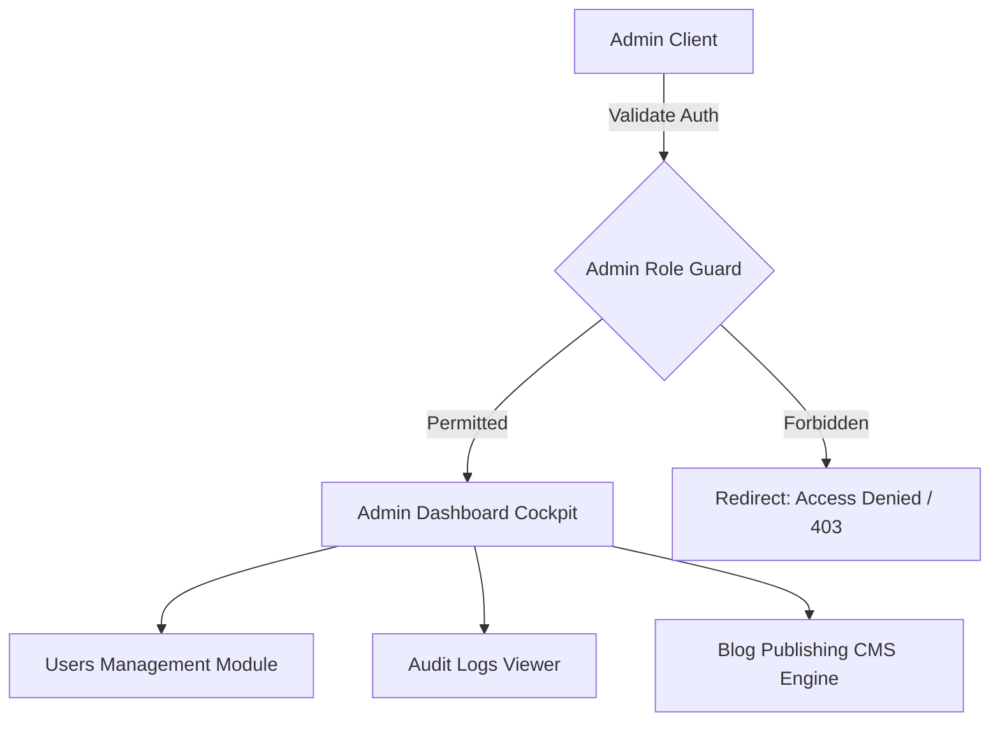

This page documents the features and management tools available in the Mockrithm **Admin Control Panel**.

---

## 1. Admin Panel Architecture

The Admin Panel is a secure interface accessible only to users with the `"Admin"` role in their Firestore profile. It allows administrators to monitor platform operations and manage content.



---

## 2. Admin Capabilities & Panels

The Admin Panel is split into three main modules:

<Tabs items={['Users Management', 'Audit Logging', 'Blog CMS Engine']}>
  <Tab value="Users Management">
    ### Users Administration Module
    Manage candidate accounts, roles, and plan statuses:
    - **Search & Filters:** Search for candidates by email, Clerk ID, or name.
    - **Subscription Upgrades:** Manually override a user's subscription tier (e.g., upgrade a user to `pro` or `premium`).
    - **Suspensions:** Temporarily suspend accounts that violate platform policies.
  </Tab>
  <Tab value="Audit Logging">
    ### Platform Auditing & Telemetry
    Monitor system operations and user feedback:
    - **Speech Latency Auditing:** Inspect audio calibration metrics to monitor WebSocket performance.
    - **Inference Fallback Monitoring:** Track how often the evaluation pipeline falls back from Groq to Gemini.
    - **Candidate Feedback Logs:** Review generated feedback reports for quality control.
  </Tab>
  <Tab value="Blog CMS Engine">
    ### Blog Publishing Engine
    Create and manage content for the platform blog:
    - **Markdown Editor:** Write technical articles using Markdown formatting.
    - **Metadata Controls:** Configure tags, read time estimates, and SEO titles.
    - **Firestore Publishing:** Publish articles directly to the global `/blogs` Firestore collection.
  </Tab>
</Tabs>

---

## 3. Server Actions & Database Operations

The Admin Panel relies on Next.js Server Actions to securely execute database changes:

```typescript
"use server";

import { db } from "@/firebase/admin";
import { auth } from "@clerk/nextjs/server";

// Helper function to verify admin permissions
async function verifyAdminOrThrow() {
  const { userId } = await auth();
  if (!userId) throw new Error("Unauthenticated request");

  const userDoc = await db.collection("users").doc(userId).get();
  if (!userDoc.exists || userDoc.data()?.role !== "Admin") {
    throw new Error("Access denied: Admin role required");
  }
}

export async function updateUserSubscriptionTier(targetUserId: string, targetTier: "freemium" | "premium" | "pro") {
  await verifyAdminOrThrow();

  try {
    await db.collection("users").doc(targetUserId).set({
      tier: targetTier,
      updatedAt: new Date().toISOString()
    }, { merge: true });

    return { success: true };
  } catch (error) {
    console.error("Failed to update subscription tier:", error);
    return { success: false, error: "Database update failed" };
  }
}
```

---

## 4. Troubleshooting & Operational Security

<Callout type="warn" title="Role Escalation Protection">
The `"role"` parameter cannot be modified through the standard client profile dashboard. Admin privileges must be set manually directly in the Firestore Console to prevent role-escalation security exploits.
</Callout>

<Accordions>
  <Accordion title="Accessing Local Admin Views">
    To test the Admin Panel in your local environment:
    1. Log in to your application using the Clerk interface.
    2. Open your Firestore local emulator or console.
    3. Find your user document matching your Clerk ID and change the `role` value from `"User"` to `"Admin"`.
  </Accordion>
</Accordions>
