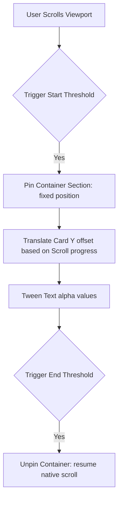

This page documents the GreenSock (GSAP) ScrollTrigger setup used to orchestrate the layered card pinning and transition animations on the landing showcase page.

---

## 1. Interaction Design Concept

The features showcase uses a stacked cards layout. As the candidate scrolls:
1. The base section container locks in place.
2. Subsequent panels slide up and stack over the prior ones.
3. Text modules fade in and out based on the scroll progress of the active card.



---

## 2. GSAP Implementation Blueprint

Below is the configuration to initialize GSAP ScrollTrigger inside a React/Next.js client component:

```typescript
import { useEffect, useRef } from "react";
import { gsap } from "gsap";
import { ScrollTrigger } from "gsap/ScrollTrigger";

export default function StackedShowcase() {
  const containerRef = useRef<HTMLDivElement>(null);

  useEffect(() => {
    if (typeof window === "undefined") return;
    
    // Register the ScrollTrigger plugin
    gsap.registerPlugin(ScrollTrigger);

    const container = containerRef.current;
    if (!container) return;

    const cards = container.querySelectorAll(".showcase-card");
    if (cards.length === 0) return;

    // Create a master GSAP Timeline
    const tl = gsap.timeline({
      scrollTrigger: {
        trigger: container,
        start: "top top",      // Pin when the top of the container hits the top of the viewport
        end: `+=${cards.length * 100}%`, // Scroll height matches number of cards
        scrub: true,           // Smoothly tie animations to scrollbar progress
        pin: true,             // Pin the container in place
        anticipatePin: 1,      // Prevents minor layout jumps
      }
    });

    // Build timeline animations for each card
    cards.forEach((card, idx) => {
      if (idx === 0) return; // First card is already visible

      tl.fromTo(
        card,
        { yPercent: 100 }, // Start off-screen
        {
          yPercent: 0,     // Slide into place
          ease: "none",
          duration: 1
        }
      ).fromTo(
        card.querySelector(".text-module"),
        { opacity: 0, y: 30 },
        { opacity: 1, y: 0, duration: 0.5 },
        "-=0.5" // Overlap animations for a smoother transition
      );
    });

    return () => {
      // Kill all ScrollTriggers on component unmount
      ScrollTrigger.getAll().forEach((trigger) => trigger.kill());
    };
  }, []);

  return (
    <div ref={containerRef} className="relative w-full overflow-hidden bg-background">
      {/* Cards markup */}
    </div>
  );
}
```

---

## 3. Important Implementation Notes

<Callout type="warn" title="Preventing Layout Shifting">
Always set `box-sizing: border-box` and ensure the pinned container has `overflow: hidden`. If child elements spill outside the container boundaries, GSAP will compute incorrect height dimensions, causing page-level layout shifts.
</Callout>

- **Mobile optimization:** On touch interfaces, complex scroll animations can stutter. Disable scroll pinning for screen widths below `768px` by passing a matchMedia guard:
  ```typescript
  let mm = gsap.matchMedia();
  mm.add("(min-width: 768px)", () => {
    // Initialize pinning timeline here
  });
  ```
- **Will-Change optimization:** Add CSS `will-change: transform` to cards in your stylesheets to force browser layout engines to render cards on dedicated GPU layers.
