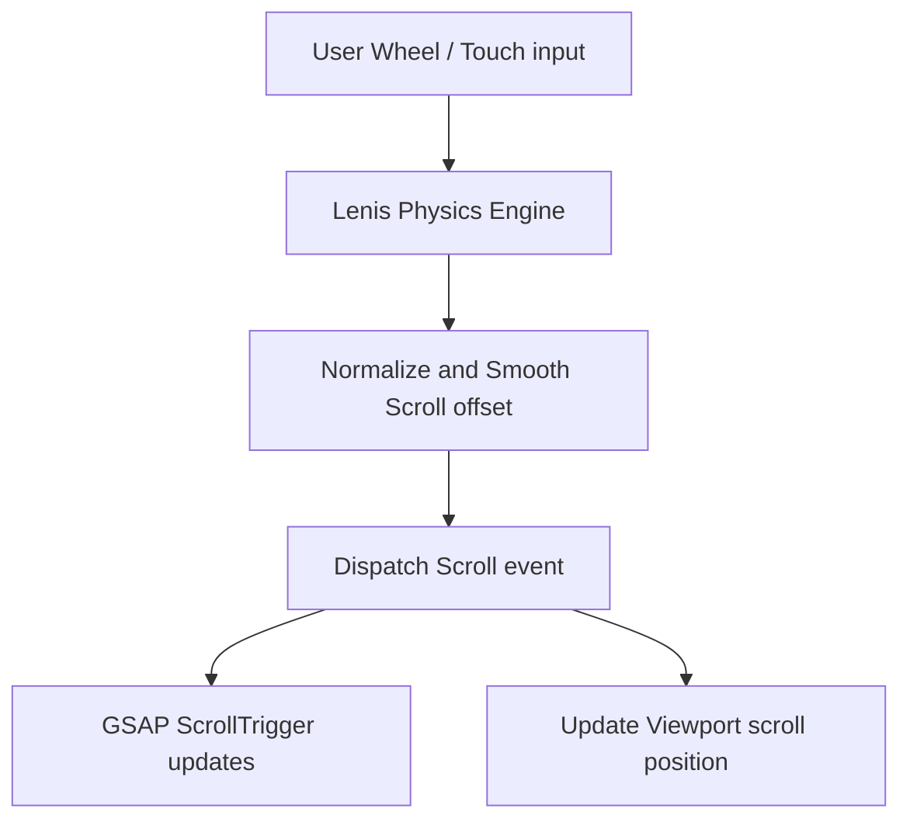

This page provides the configuration and synchronization steps for **Lenis**, our smooth-scrolling library that ensures scroll transitions remain consistent across different browsers and operating systems.

---

## 1. Scroll Synchronization Concept

By default, scroll physics differ across browsers (e.g. Firefox, Safari, and Chrome) and operating systems (e.g. macOS and Windows). Lenis intercepts wheel and touch events, normalizes their physics, and outputs a smooth interpolation, which is then synced with GSAP's scroll timelines.



---

## 2. Next.js Implementation Blueprint

Below is the code to initialize and manage Lenis inside your main layout wrapper (`app/components/shared/LenisProvider.tsx`):

```typescript
"use client";

import { useEffect, useRef } from "react";
import Lenis from "lenis";
import { gsap } from "gsap";
import { ScrollTrigger } from "gsap/ScrollTrigger";

export default function LenisProvider({ children }: { children: React.ReactNode }) {
  const lenisRef = useRef<Lenis | null>(null);

  useEffect(() => {
    if (typeof window === "undefined") return;

    // 1. Initialize Lenis with custom easing parameters
    const lenis = new Lenis({
      duration: 1.2,       // Scroll animation duration in seconds
      easing: (t) => Math.min(1, 1.001 - Math.pow(2, -10 * t)), // Custom exponential easing
      wheelMultiplier: 0.9, // Adjust scroll sensitivity
      touchMultiplier: 0.8,
      infinite: false,
    });

    lenisRef.current = lenis;

    // 2. Connect Lenis scroll callback to GSAP ScrollTrigger
    lenis.on("scroll", ScrollTrigger.update);

    // 3. Bind Lenis updates to the GSAP animation ticker
    const onTick = (time: number) => {
      lenis.raf(time * 1000); // Pass milliseconds
    };
    gsap.ticker.add(onTick);
    
    // 4. Set lag smoothing to zero to prevent scroll stuttering
    gsap.ticker.lagSmoothing(0);

    return () => {
      lenis.destroy();
      gsap.ticker.remove(onTick);
    };
  }, []);

  return <>{children}</>;
}
```

---

## 3. Recommended Parameters Reference

Adjust these options in the Lenis constructor to fine-tune the scrolling experience:

| Property Key | Recommended Value | Range / Type | Impact on Scroll Physics |
| :--- | :--- | :--- | :--- |
| `duration` | `1.2` | `0.5 - 2.5 (seconds)` | Speed of the scroll easing transition. |
| `lerp` | `undefined` | `0.01 - 0.2` | Alternative linear interpolation factor (use either duration or lerp, not both). |
| `wheelMultiplier` | `0.9` | `0.1 - 2.0` | Adjusts scroll speed on desktop mouse wheels. |
| `touchMultiplier` | `0.8` | `0.1 - 2.0` | Adjusts swipe sensitivity on mobile viewports. |

---

## 4. Best Practices & Troubleshooting

<Accordions>
  <Accordion title="Lenis and CSS Position: Sticky conflicts">
    Sometimes smooth-scrolling engines conflict with native CSS `position: sticky`. If you notice sticky panels jittering, apply `will-change: transform` to the sticky container, or manage the sticky position using GSAP scroll triggers instead of CSS.
  </Accordion>
  <Accordion title="Preventing Double Scrollbars">
    Ensure your layout stylesheet has the following rules to prevent double scrollbars:
    ```css
    html.lenis, html.lenis body {
      height: auto;
    }
    .lenis-smooth {
      scroll-behavior: auto !important;
    }
    ```
  </Accordion>
</Accordions>
