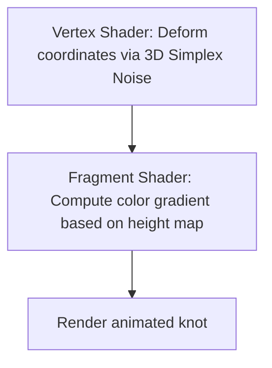

This page documents the GLSL Vertex and Fragment shaders used to deform the geometric particle knots and animate the interactive visualizer backdrops on the Mockrithm landing page.

---

## 1. Shader Architecture & Uniforms

The centerpiece uses a custom `ShaderMaterial` that deforms a sphere geometry using 3D Simplex Noise. This creates a pulsing, organic wave effect.



---

## 2. GLSL Vertex Shader Implementation

Below is the GLSL source code for the vertex shader (`deform.vert`), which includes simplex noise formulas:

```glsl
// GLSL Vertex Shader: deform.vert
uniform float uTime;
uniform float uNoiseFreq;
uniform float uNoiseAmp;

varying vec2 vUv;
varying float vNoiseHeight;

// Description : Array and textureless GLSL 2D/3D/4D simplex 
//               noise functions.
//      Author : Ian McEwan, Ashima Arts.
vec3 permute(vec3 x) { return mod(((x*34.0)+1.0)*x, 289.0); }

float snoise(vec3 v) {
  const vec2 C = vec2(1.0/6.0, 1.0/3.0);
  const vec4 D = vec4(0.0, 0.5, 1.0, 2.0);

  // First corner
  vec3 i  = floor(v + dot(v, C.yyy));
  vec3 x0 = v - i + dot(i, C.xxx);

  // Other corners
  vec3 g = step(x0.yzx, x0.xyz);
  vec3 l = 1.0 - g;
  vec3 i1 = min(g.xyz, l.zxy);
  vec3 i2 = max(g.xyz, l.zxy);

  vec3 x1 = x0 - i1 + 1.0 * C.xxx;
  vec3 x2 = x0 - i2 + 2.0 * C.xxx;
  vec3 x3 = x0 - D.yyy;

  // Permutations
  i = mod(i, 289.0);
  vec4 p = permute(permute(permute(
             i.z + vec4(0.0, i1.z, i2.z, 1.0))
           + i.y + vec4(0.0, i1.y, i2.y, 1.0))
           + i.x + vec4(0.0, i1.x, i2.x, 1.0));

  // Gradients
  float n_ = 1.0/7.0; // N=7
  vec3  ns = n_ * D.wyz - D.xzx;

  vec4 j = p - 49.0 * floor(p * ns.z);  //  mod(p,N*N)

  vec4 x_ = floor(j * ns.z);
  vec4 y_ = floor(j - 7.0 * x_);    //  mod(j,N)

  vec4 x = x_ * ns.x + ns.yyyy;
  vec4 y = y_ * ns.x + ns.yyyy;
  vec4 h = 1.0 - abs(x) - abs(y);

  vec4 b0 = vec4(x.xy, y.xy);
  vec4 b1 = vec4(x.zw, y.zw);

  vec4 s0 = floor(b0)*2.0 + 1.0;
  vec4 s1 = floor(b1)*2.0 + 1.0;
  vec4 sh = -step(h, vec4(0.0));

  vec4 a0 = b0.xzyw + s0.xzyw*sh.xxyy;
  vec4 a1 = b1.xzyw + s1.xzyw*sh.zzww;

  vec3 p0 = vec3(a0.xy, h.x);
  vec3 p1 = vec3(a0.zw, h.y);
  vec3 p2 = vec3(a1.xy, h.z);
  vec3 p3 = vec3(a1.zw, h.w);

  // Normalise gradients
  vec4 norm = 1.79284291400159 - 0.85373472095314 * vec4(dot(p0,p0), dot(p1,p1), dot(p2, p2), dot(p3,p3));
  p0 *= norm.x;
  p1 *= norm.y;
  p2 *= norm.z;
  p3 *= norm.w;

  // Mix final noise value
  vec4 m = max(0.6 - vec4(dot(x0,x0), dot(x1,x1), dot(x2,x2), dot(x3,x3)), 0.0);
  m = m * m;
  return 42.0 * dot(m*m, vec4(dot(p0,x0), dot(p1,x1), dot(p2,x2), dot(p3,x3)));
}

void main() {
  vUv = uv;
  
  // Calculate noise value based on position and time
  vec3 noisePos = position * uNoiseFreq + vec3(0.0, 0.0, uTime);
  float noiseVal = snoise(noisePos);
  
  // Deform vertex position along its normal vector
  vNoiseHeight = noiseVal;
  vec3 newPosition = position + normal * noiseVal * uNoiseAmp;
  
  gl_Position = projectionMatrix * modelViewMatrix * vec4(newPosition, 1.0);
}
```

---

## 3. GLSL Fragment Shader Implementation

Below is the fragment shader (`deform.frag`) configuration that maps the noise deformation to a color gradient:

```glsl
// GLSL Fragment Shader: deform.frag
varying vec2 vUv;
varying float vNoiseHeight;

void main() {
  // Map height noise value to a monochromatic color gradient
  vec3 colorA = vec3(0.03, 0.03, 0.05); // Zinc-950
  vec3 colorB = vec3(1.0, 1.0, 1.0);    // Neon White glow
  
  // Blend colors using noise height map
  float mixVal = clamp((vNoiseHeight + 1.0) * 0.5, 0.0, 1.0);
  vec3 finalColor = mix(colorA, colorB, mixVal);
  
  gl_FragColor = vec4(finalColor, 1.0);
}
```

---

## 4. Initializing Shader Material in React/Three

Configure the uniforms in your Three.js script as follows:

```typescript
const material = new THREE.ShaderMaterial({
  vertexShader: myVertexShaderCode,
  fragmentShader: myFragmentShaderCode,
  uniforms: {
    uTime: { value: 0.0 },
    uNoiseFreq: { value: 1.8 },
    uNoiseAmp: { value: 0.25 }
  }
});

// Inside your requestAnimationFrame render tick:
function animate(time: number) {
  material.uniforms.uTime.value = time * 0.001; // Pass elapsed seconds
  renderer.render(scene, camera);
}
```

<Callout type="info" title="Precision Settings">
For mobile devices, specify `precision mediump float;` at the top of both shaders to conserve GPU processing cycles.
</Callout>
