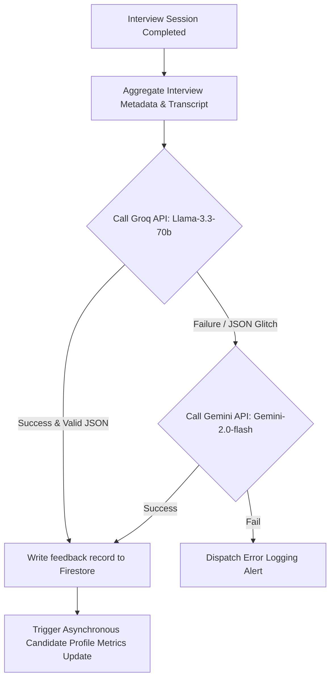

This page provides the architecture and code blueprints for Mockrithm's assessment engine, which evaluates candidate transcript metrics and generates structured feedback reports.

---

## 1. Engine Architecture & Dual-Route Flow

The assessment engine uses a dual-route pipeline to ensure feedback is generated with low latency and high structural reliability.

1. **Primary Route (Groq):** Generates fast assessments using the `llama-3.3-70b-versatile` model.
2. **Fallback Route (Gemini):** If Groq experiences rate limits or fails JSON validation, the pipeline falls back to Google's `gemini-2.0-flash-001` or `gemini-2.5-flash` model, enforcing structured outputs using schema validation.



---

## 2. Structured JSON Output Schema

The engine relies on a strict **Zod** schema to validate the output format returned by the LLMs. This ensures that the frontend dashboard can parse and render the scoring metrics without encountering runtime errors.

```typescript
import { z } from "zod";

export const feedbackReportSchema = z.object({
  totalScore: z.number().min(0).max(100),
  categoryScores: z.array(
    z.object({
      name: z.string(),
      score: z.number().min(0).max(100),
      comment: z.string(),
    })
  ),
  strengths: z.array(z.string()).min(2),
  areasForImprovement: z.array(z.string()).min(2),
  finalAssessment: z.string().min(50),
  averageWpm: z.number(),
  topFillerWords: z.array(z.string()),
});

export type FeedbackReport = z.infer<typeof feedbackReportSchema>;
```

---

## 3. Core Engine Action Implementation

Here is the implementation code of the Next.js Server Action (`lib/actions/evaluate.ts`) handling the evaluation process:

```typescript
import { generateText, generateObject } from "ai";
import { groq } from "@ai-sdk/groq";
import { google } from "@ai-sdk/google";
import { db } from "@/firebase/admin";
import { feedbackReportSchema, FeedbackReport } from "@/types/feedback";

export async function evaluateSession(interviewId: string): Promise<{ success: boolean; data?: FeedbackReport }> {
  try {
    // 1. Fetch interview transcript from Firestore
    const interviewDoc = await db.collection("interviews").doc(interviewId).get();
    if (!interviewDoc.exists) throw new Error("Session record not found");
    const sessionData = interviewDoc.data();

    const formattedTranscript = sessionData?.transcript
      .map((t: any) => `${t.role.toUpperCase()}: ${t.content}`)
      .join("\n");

    const prompt = `Evaluate the following interview transcript for a candidate targetting the role: ${sessionData?.role} (${sessionData?.experience} level).
    
    Transcript:
    ${formattedTranscript}`;

    // 2. Execute Primary Route: Groq
    try {
      const response = await generateObject({
        model: groq("llama-3.3-70b-versatile"),
        schema: feedbackReportSchema,
        prompt: prompt,
        temperature: 0.2,
      });

      if (response.object) {
        await saveFeedback(interviewId, sessionData?.userId, response.object);
        return { success: true, data: response.object };
      }
    } catch (groqError) {
      console.warn("Groq validation failed, running Gemini fallback...", groqError);
    }

    // 3. Fallback Route: Gemini
    const fallbackResponse = await generateObject({
      model: google("gemini-2.0-flash-001"),
      schema: feedbackReportSchema,
      prompt: prompt,
      temperature: 0.25,
    });

    await saveFeedback(interviewId, sessionData?.userId, fallbackResponse.object);
    return { success: true, data: fallbackResponse.object };

  } catch (error) {
    console.error("Evaluation pipeline failed completely:", error);
    return { success: false };
  }
}

async function saveFeedback(interviewId: string, userId: string, feedback: FeedbackReport) {
  const feedbackRef = db.collection("interviewsfeedback").doc();
  await feedbackRef.set({
    ...feedback,
    interviewId,
    userId,
    createdAt: new Date().toISOString()
  });
}
```

---

## 4. Operational Troubleshooting

<Accordions>
  <Accordion title="Rate-Limiting Mitigation">
    Groq developer keys are subject to strict RPM limits. If you experience persistent rate-limit exceptions, modify the prompt structure to be more concise and adjust the Next.js fetch timeouts to fail over to Gemini after `4000ms`.
  </Accordion>
  <Accordion title="Schema Drift & Fallbacks">
    Whenever you add new keys to `feedbackReportSchema`, verify that they are supported by both the primary Groq and the fallback Gemini prompt parsing. If the LLMs fail to supply new parameters, the schema parsing library will trigger a verification error and activate the fallback.
  </Accordion>
</Accordions>
