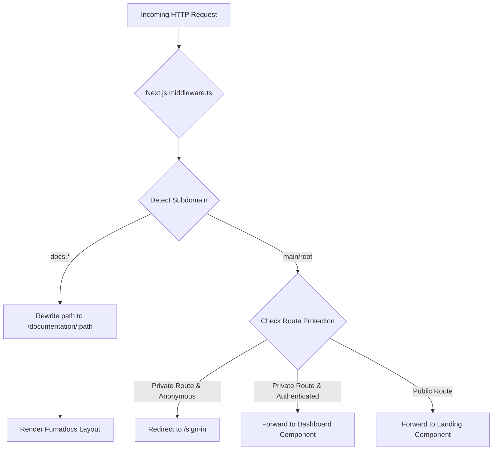

This document describes how Mockrithm handles request routing, authentication guards, and dynamic subdomain resolution in Next.js using Clerk Middleware.

---

## 1. Middleware Architecture Overview

The system uses a single root `middleware.ts` file that executes before every route request. The middleware serves two main purposes:

1. **Authentication Guards:** Blocks unauthenticated requests from accessing private pages (like the user dashboard, settings, or mock interview sandbox).
2. **Dynamic Subdomain Resolving:** Detects the host header (e.g., `docs.mockrithm.me`) and rewrites the incoming path to matching sub-folders (like `/documentation/*`) so that subdomain pages are served correctly under custom layouts.



---

## 2. Middleware Implementation Blueprint

Here is the source code blueprint for `middleware.ts` configured for Clerk and subdomains routing:

```typescript
import { clerkMiddleware, createRouteMatcher } from "@clerk/nextjs/server";
import { NextResponse } from "next/server";

// Define pages requiring authentication
const isProtectedRoute = createRouteMatcher([
  "/dashboard(.*)",
  "/interview(.*)",
  "/admin(.*)",
  "/user(.*)"
]);

export default clerkMiddleware(async (auth, request) => {
  const url = request.nextUrl.clone();
  const host = request.headers.get("host") || "";
  
  // 1. Resolve Subdomains dynamically
  if (host.startsWith("docs.")) {
    // If user accesses docs.mockrithm.me, rewrite path internally to /documentation
    url.pathname = `/documentation${url.pathname}`;
    return NextResponse.rewrite(url);
  }
  
  if (host.startsWith("blog.")) {
    url.pathname = `/blog${url.pathname}`;
    return NextResponse.rewrite(url);
  }

  // 2. Enforce authentication guards
  if (isProtectedRoute(request)) {
    const session = await auth();
    if (!session.userId) {
      // Redirect anonymous user to Sign-in route
      return NextResponse.redirect(new URL("/sign-in", request.url));
    }
  }

  return NextResponse.next();
});

export const config = {
  matcher: [
    // Skip Next.js internals and static assets, but run for everything else
    "/((?!_next|[^?]*\\.(?:html|css|js|jpe?g|png|gif|svg|ico|csv|docx?|xlsx?|zip|webmanifest)).*)",
    "/(api|trpc)(.*)",
  ],
};
```

---

## 3. Dynamic Route Rewrites Reference

Below is a summary of the internal path rewrites performed based on host headers:

| Host Header Target | Example URL Request | Internal Rewrite Path | Resulting Page layout |
| :--- | :--- | :--- | :--- |
| `docs.mockrithm.me` | `https://docs.mockrithm.me/dev/groq` | `/documentation/dev/groq` | Serves the Groq documentation page |
| `blog.mockrithm.me` | `https://blog.mockrithm.me/new-features` | `/blog/new-features` | Serves the specific blog article page |
| `mockrithm.me` (Root) | `https://mockrithm.me/dashboard` | `/dashboard` | Protected dashboard workspace view |

<Callout type="warn" title="Subdomain Cookie Handling">
Since authentication cookies are set on the root domain (`mockrithm.me`), make sure your Clerk settings allow **Wildcard Subdomains** (e.g. `.mockrithm.me`) so users remain logged in when navigating from `mockrithm.me` to `docs.mockrithm.me`.
</Callout>

---

## 4. Protected API Endpoints Protection

For REST endpoint files (placed under `/app/api/*`), Next.js routes must check headers manually when Server Actions are not leveraged:

```typescript
import { auth } from "@clerk/nextjs/server";
import { NextResponse } from "next/server";

export async function GET() {
  const session = await auth();
  if (!session.userId) {
    return new NextResponse("Unauthorized API Request", { status: 401 });
  }
  
  // Endpoint specific execution
  return NextResponse.json({ status: "Success" });
}
```
