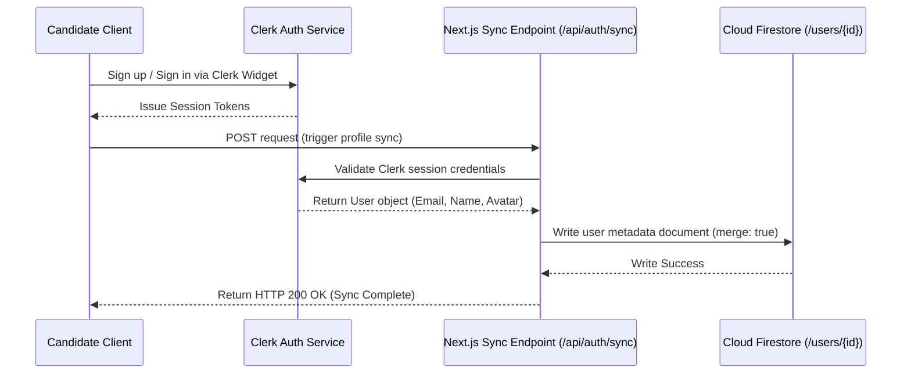

This document outlines the user profile synchronization logic that bridges the identity layer (Clerk) with the database layer (Firebase Firestore).

---

## 1. Synchronization Architecture

When a candidate registers on Mockrithm, they authenticate through the Clerk UI. However, to track their resumes, billing subscriptions, and mock interview statistics, Mockrithm requires a matching record in the Firestore `/users` collection.



---

## 2. Sync Code Implementation

The synchronization is handled by a Next.js API Route handler that securely uses the Firebase Admin SDK to write the database documents.

<Tabs items={['Next.js Route Handler', 'Firebase Configuration']}>
  <Tab value="Next.js Route Handler">
    ### Route Handler: `app/api/auth/sync/route.ts`
    ```typescript
    import { db } from "@/firebase/admin";
    import { currentUser } from "@clerk/nextjs/server";
    import { NextResponse } from "next/server";

    export async function POST() {
      // 1. Fetch authenticated session details from Clerk SDK
      const user = await currentUser();
      
      if (!user) {
        return new NextResponse("Unauthorized request: no session found", { status: 401 });
      }

      // 2. Target the user document reference using Clerk's ID
      const userRef = db.collection("users").doc(user.id);
      
      // 3. Perform a upsert (merge: true) to avoid overwriting billing properties
      await userRef.set({
        email: user.emailAddresses[0].emailAddress,
        name: `${user.firstName || ""} ${user.lastName || ""}`.trim(),
        avatarUrl: user.imageUrl,
        role: "User", // Defaults to candidate role
        status: "Active",
        updatedAt: new Date().toISOString()
      }, { merge: true });

      return NextResponse.json({ 
        success: true, 
        userId: user.id 
      });
    }
    ```
  </Tab>
  <Tab value="Firebase Configuration">
    ### Firebase Admin SDK Loader: `firebase/admin.ts`
    ```typescript
    import admin from "firebase-admin";

    if (!admin.apps.length) {
      admin.initializeApp({
        credential: admin.credential.cert({
          projectId: process.env.FIREBASE_PROJECT_ID,
          clientEmail: process.env.FIREBASE_CLIENT_EMAIL,
          privateKey: process.env.FIREBASE_PRIVATE_KEY?.replace(/\\n/g, "\n"),
        }),
      });
    }

    export const db = admin.firestore();
    ```
  </Tab>
</Tabs>

---

## 3. Important Implementation Notes

<Callout type="warn" title="Preventing Plan Overwrites">
Never run `userRef.set(...)` with `merge: false` (or without passing `{ merge: true }`). Doing so will delete other crucial properties in the document (like `stripeCustomerId`, `tier`, or `createdAt` timestamp) when the user updates their profile.
</Callout>

- **Initial Role Setup:** The system default role is always set to `"User"`. Administrator status (`"Admin"`) must be modified manually in the Firestore console to prevent privilege escalation.
- **Handling Avatar Changes:** When a user updates their profile avatar picture in Clerk, the `avatarUrl` is sync'd during the next app load or checkout hook.
