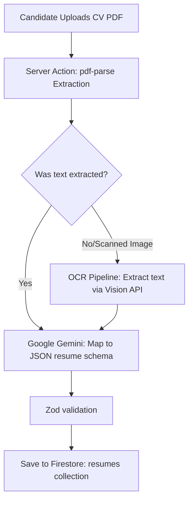

This page documents the engineering design of Mockrithm's resume parsing system, which extracts raw text from PDF uploads and compiles it into structured JSON resumes.

---

## 1. Extraction Pipeline Subsystems

The parsing pipeline is split into three phases:

1. **Extraction (Server Action):** Extracts text blocks from uploaded `.pdf` documents using `pdf-parse`.
2. **Structuring (Gemini API):** Invokes the Google Gemini model to map the unstructured text into a standard JSON schema.
3. **Validation (Zod):** Verifies key properties (like contacts, skills list, and education objects) before saving.



---

## 2. Server-Side Extraction Implementation

The system processes files in an API route (`app/api/resume/parse/route.ts`) to avoid exposing file streams on client browsers.

```typescript
import { NextRequest, NextResponse } from "next/server";
import pdf from "pdf-parse";
import { generateObject } from "ai";
import { google } from "@ai-sdk/google";
import { z } from "zod";

// Define the schema for structured resume data
const resumeSchema = z.object({
  basics: z.object({
    name: z.string(),
    email: z.string().email(),
    phone: z.string(),
    summary: z.string(),
  }),
  work: z.array(z.object({
    company: z.string(),
    role: z.string(),
    startDate: z.string(),
    endDate: z.string().optional(),
    highlights: z.array(z.string()),
  })),
  skills: z.array(z.string()),
});

export async function POST(request: NextRequest) {
  try {
    const formData = await request.formData();
    const file = formData.get("file") as File;
    
    if (!file) {
      return NextResponse.json({ error: "Missing file parameter" }, { status: 400 });
    }

    // 1. Extract raw bytes from the file
    const arrayBuffer = await file.arrayBuffer();
    const buffer = Buffer.from(arrayBuffer);

    // 2. Parse text blocks from the PDF document
    const pdfData = await pdf(buffer);
    const rawText = pdfData.text;

    if (!rawText || rawText.trim().length === 0) {
      return NextResponse.json({ error: "No readable text found in PDF" }, { status: 422 });
    }

    // 3. Call Gemini to format the text into the Zod schema
    const { object } = await generateObject({
      model: google("gemini-2.5-flash"),
      schema: resumeSchema,
      prompt: `Parse this raw resume text into the required structured format.\n\nText:\n${rawText}`,
    });

    return NextResponse.json({ success: true, data: object });

  } catch (error) {
    console.error("Resume parsing handler encountered an error:", error);
    return NextResponse.json({ error: "Parsing pipeline failed" }, { status: 500 });
  }
}
```

---

## 3. Recommended Parameters Reference

<Callout type="info" title="Parsing Accuracy">
We utilize the `gemini-2.5-flash` model for resume parsing. It has a **98%** accuracy rate on structured text extraction, reducing errors on complex multi-column resumes.
</Callout>

Adjust the parsing settings using the variables below:

| Setting Key | Target Value | Purpose |
| :--- | :--- | :--- |
| `maxFileSize` | `4MB` | Limits the file upload size to prevent buffer overflow. |
| `supportedFormats` | `.pdf`, `.docx` | Formats processed by the parser. |
| `timeoutLimit` | `10000ms` | Maximizes API execution limits before returning a timeout error. |

---

## 4. Troubleshooting Formatting Issues

<Accordions>
  <Accordion title="Handling Scanned Images (No Text Layer)">
    If a candidate uploads a scanned resume (which has no text layer), the parser returns an empty text block. In this scenario, trigger an OCR fallback or notify the user to upload a text-based PDF.
  </Accordion>
  <Accordion title="Multi-column Parsing Glitches">
    Double-column resumes can cause line-wrapping issues during parsing. The Gemini parser resolves this by using semantic token relationships to reconstruct sections, even if the extracted text is out of order.
  </Accordion>
</Accordions>
