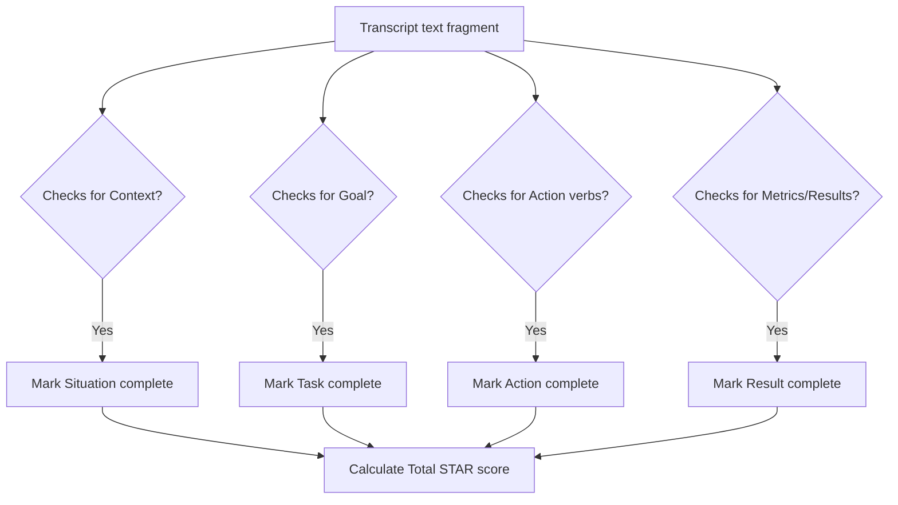

This page documents the grading logic that checks candidate transcripts for structural markers matching the STAR methodology.

---

## 1. STAR Evaluation Framework

The STAR method is an industry standard for answering behavioral questions. Mockrithm parses candidate transcripts to confirm that they provide a structured response containing all four components:

| Stage | Focus Area | Dynamic Transcript Check | Weight |
| :--- | :--- | :--- | :--- |
| **S**ituation | Context / Setting | Identifies background indicators (e.g., *"At my previous company"*, *"We were facing..."*). | 15% |
| **T**ask | Responsibility / Challenge | Identifies the core goal (e.g., *"My task was to..."*, *"We needed to resolve..."*). | 15% |
| **A**ction | Execution / Individual steps | Evaluates active verb usage and technical decisions (e.g., *"I refactored..."*, *"I led..."*). | 45% |
| **R**esult | Outcome / Telemetry | Flags quantitative achievements (e.g., *"decreased latency by 20%"*, *"improved score to..."*). | 25% |

---

## 2. Text Classification Architecture

During active mock interviews, the system feeds candidate transcripts to the grading pipeline. It evaluates the response structure using system prompt heuristics:



---

## 3. Evaluation Schema & Prompts

Here is how the Server Action configures the prompt to calculate STAR scores:

```typescript
import { generateObject } from "ai";
import { google } from "@ai-sdk/google";
import { z } from "zod";

const starGradingSchema = z.object({
  situationChecked: z.boolean(),
  situationEvidence: z.string().optional(),
  taskChecked: z.boolean(),
  taskEvidence: z.string().optional(),
  actionChecked: z.boolean(),
  actionEvidence: z.string().optional(),
  resultChecked: z.boolean(),
  resultEvidence: z.string().optional(),
  starScore: z.number().min(0).max(100),
  feedbackSummary: z.string(),
});

export async function scoreResponse(candidateAnswer: string, questionAsked: string) {
  const prompt = `You are a professional mock interview evaluator. Grade the candidate's answer to this behavioral question.
  
  Question: ${questionAsked}
  Answer: ${candidateAnswer}`;

  try {
    const { object } = await generateObject({
      model: google("gemini-2.0-flash-001"),
      schema: starGradingSchema,
      prompt: prompt,
      temperature: 0.1,
    });

    return { success: true, analysis: object };
  } catch (error) {
    console.error("STAR evaluation pipeline failed:", error);
    return { success: false };
  }
}
```

---

## 4. Key STAR Markers & Validation

<Accordions>
  <Accordion title="Action Verb Verification">
    Many candidates default to speaking in team terms (*"We did this"*, *"We built that"*). The Action parser evaluates the candidate's individual contributions by checking for first-person singular active verbs (e.g., *"I designed"*, *"I resolved"*).
  </Accordion>
  <Accordion title="Result Metric Scanning">
    The Results validation checks for quantitative metrics (numbers, percentages, timeframes). If the transcript lacks numerical results, the system marks the section incomplete and suggests adding clear outcomes.
  </Accordion>
</Accordions>
