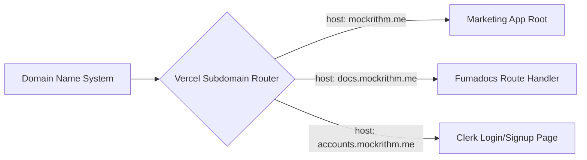

This document outlines the deployment workflow and hosting configurations for Mockrithm. The production setup utilizes **Vercel** for hosting the application layers, **Google Cloud Firebase** for databases, and automated **GitHub Actions** for CI/CD pipelines.

---

## 1. Hosting Architecture Overview

Mockrithm runs as a multi-domain web service on Vercel:

- **Root Domain (`mockrithm.me`):** Serves marketing landing pages, pricing grids, and features.
- **Documentation Subdomain (`docs.mockrithm.me`):** Routes traffic to the Fumadocs collection handlers (`/documentation/*`).
- **Dashboard Workspace:** Managed dynamically on the root domain behind route guards.



---

## 2. Vercel Configuration Layout

To manage subdomain routing and redirect flows, Mockrithm includes a `vercel.json` deployment manifest:

```json
{
  "version": 2,
  "cleanUrls": true,
  "rewrites": [
    {
      "source": "/documentation/:path*",
      "destination": "/app/documentation/:path*"
    }
  ],
  "headers": [
    {
      "source": "/(.*)",
      "headers": [
        {
          "key": "X-Frame-Options",
          "value": "DENY"
        },
        {
          "key": "X-Content-Type-Options",
          "value": "nosniff"
        },
        {
          "key": "Referrer-Policy",
          "value": "strict-origin-when-cross-origin"
        }
      ]
    }
  ]
}
```

---

## 3. Step-by-Step Vercel Deployment

Deploy the application by completing these setup stages:

<Steps>
  <Step>
    ### Create Vercel Project
    Connect your GitHub repository to Vercel and create a new project. Select the **Next.js** framework preset.
  </Step>
  <Step>
    ### Configure Build Command Settings
    Ensure your project settings on Vercel match the following values:
    - **Build Command:** `next build`
    - **Install Command:** `npm install`
    - **Output Directory:** `.next`
  </Step>
  <Step>
    ### Bind Production Environment Variables
    Add all the values from your `.env` workspace file to the Vercel **Environment Variables** console. 
    
    <Callout type="warn" title="Clerk Production Keys">
    Make sure you swap your test credentials (`pk_test_...` and `sk_test_...`) for your live production Clerk API tokens (`pk_live_...` and `sk_live_...`).
    </Callout>
  </Step>
  <Step>
    ### Deploy Database Indices
    Initialize indexes and configurations in Google Cloud Console. Run the deploy command from your terminal:
    ```bash
    npm install -g firebase-tools
    firebase login
    firebase deploy --only firestore:indexes
    ```
  </Step>
</Steps>

---

## 4. Webhook Integrations Setup

To keep external systems in sync, configure these webhooks:

<Accordions>
  <Accordion title="Clerk Webhooks">
    - **Payload:** User creation, metadata edits, and user deletions.
    - **Endpoint:** `https://mockrithm.me/api/auth/sync`
    - **Validation:** Verify the `svix-id` and `svix-signature` headers from the request payload to ensure it matches the Svix signing secret.
  </Accordion>
  <Accordion title="Stripe Webhooks">
    - **Payload:** Checkout session success, customer subscription changes, and payment failures.
    - **Endpoint:** `https://mockrithm.me/api/payment/webhook`
    - **Validation:** Construct the event signature verification using the Stripe SDK with the `STRIPE_WEBHOOK_SECRET`.
  </Accordion>
</Accordions>
