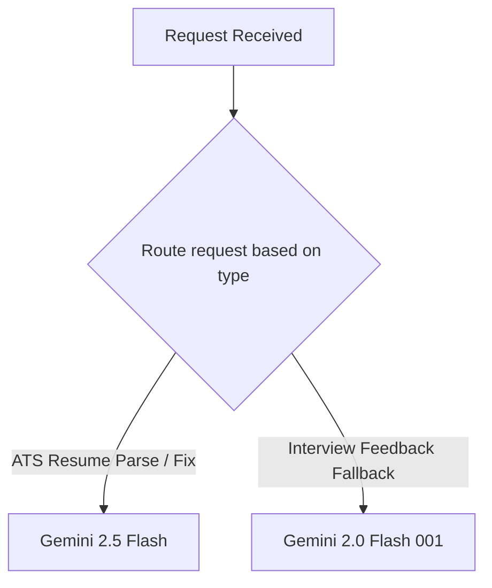

This page provides configuration and setup instructions for integrating **Google Gemini** models inside Mockrithm.

---

## 1. Architectural Role

Mockrithm utilizes Google Gemini in two main roles:
1. **Fallback Assessment Engine:** Serves as the backup generator for mock interview feedback reports when Groq experiences rate limits or fails JSON validation.
2. **ATS Resume Parser & Optimizer:** Powers our resume scanning workspace, checking documents for keyword alignment and formatting suggestions.



---

## 2. Model Configuration Configuration

The platform imports the `@ai-sdk/google` integration library. Below is the code to configure the client:

```typescript
import { createGoogleGenerativeAI } from "@ai-sdk/google";

// 1. Initialize the Google Generative AI client wrapper
export const googleAI = createGoogleGenerativeAI({
  apiKey: process.env.GEMINI_API_KEY,
});

// 2. Export pre-configured model references
export const feedbackFallbackModel = googleAI("gemini-2.0-flash-001");
export const resumeOptimizationModel = googleAI("gemini-2.5-flash");
```

---

## 3. Recommended Parameters

When calling Gemini APIs, use these settings:

| Parameter Key | Recommended Value | Range | Purpose |
| :--- | :--- | :--- | :--- |
| `temperature` | `0.15` | `0.0 - 2.0` | Keep low to prioritize objective structural parsing of resume details. |
| `topK` | `1` | `1 - 100` | Limits generation to high-confidence tokens. |
| `safetySettings` | Default | Standard | Prevents the generation of harmful content. |

---

## 4. Resume Optimization Action Blueprint

Here is how we call Gemini to optimize candidate resumes:

```typescript
import { generateObject } from "ai";
import { resumeOptimizationModel } from "./gemini";
import { z } from "zod";

const resumeFixSchema = z.object({
  optimizedSummary: z.string(),
  suggestedBulletPoints: z.array(z.string()),
  missingKeywordsMatched: z.array(z.string()),
  atsScoreProjected: z.number(),
});

export async function optimizeResumeWithGemini(rawText: string, jobDescription: string) {
  const prompt = `Review this resume text and the target job description.
  
  Resume: ${rawText}
  Job Description: ${jobDescription}`;

  try {
    const { object } = await generateObject({
      model: resumeOptimizationModel,
      schema: resumeFixSchema,
      prompt: prompt,
      temperature: 0.1, // Keep low for formatting accuracy
    });

    return { success: true, data: object };
  } catch (error) {
    console.error("Gemini optimization failed:", error);
    return { success: false };
  }
}
```

<Callout type="info" title="API Key Validation">
If you encounter `API_KEY_INVALID` errors, verify that `GEMINI_API_KEY` is loaded correctly in your workspace `.env` file and is not masked by system-level config files.
</Callout>
