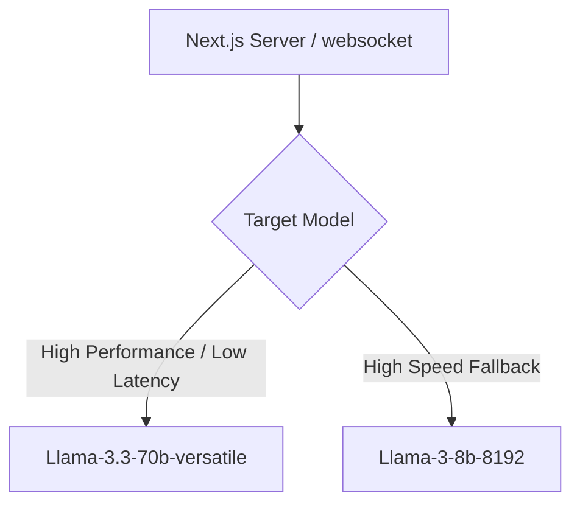

This page provides the configuration and developer setup details for the **Groq Cloud API** inside the Mockrithm platform.

---

## 1. Role in the Architecture

Mockrithm utilizes Groq as the primary engine for processing user transcripts. Groq is chosen for its hardware-accelerated processing capabilities, which deliver sub-second evaluations.



---

## 2. Model Settings & Setup

We primarily target the `llama-3.3-70b-versatile` model. Below is the configuration structure:

```typescript
import { createGroq } from "@ai-sdk/groq";

// 1. Initialize the Groq client wrapper
export const groqClient = createGroq({
  apiKey: process.env.GROQ_API_KEY,
});

// 2. Export pre-configured model references
export const primaryGroqModel = groqClient("llama-3.3-70b-versatile");
export const fallbackGroqModel = groqClient("llama-3-8b-8192");
```

---

## 3. Recommended Inference Parameters

When calling Groq to generate candidate score sheets, use the following configuration settings:

| Property Key | Recommended Value | Range | Impact on Output |
| :--- | :--- | :--- | :--- |
| `temperature` | `0.2` | `0.0 - 2.0` | Controls output variance. Keep low for strict structured data validation. |
| `maxTokens` | `2048` | `1 - 8192` | Sets the maximum length of the evaluation report. |
| `topP` | `0.9` | `0.0 - 1.0` | Restricts token selection to high-probability options. |

---

## 4. Production Handling: Rate Limiting & Verification

<Callout type="warn" title="Rate-Limiting Limits">
Groq Cloud enforces limits based on Tokens Per Minute (TPM) and Requests Per Minute (RPM). Free tier keys can only make a few requests per minute, which can trigger errors during simultaneous sessions.
</Callout>

### Recommended Fail-Safe Pattern

```typescript
import { generateObject } from "ai";
import { primaryGroqModel } from "./groq";
import { feedbackReportSchema } from "@/types/feedback";

export async function invokeGroqWithRetry(prompt: string, maxAttempts = 3) {
  let attempt = 0;
  
  while (attempt < maxAttempts) {
    try {
      attempt++;
      return await generateObject({
        model: primaryGroqModel,
        schema: feedbackReportSchema,
        prompt: prompt,
        // Enforce a strict timeout of 4000ms
        abortSignal: AbortSignal.timeout(4000)
      });
    } catch (error) {
      console.warn(`Groq execution attempt ${attempt} failed:`, error);
      if (attempt >= maxAttempts) {
        throw new Error("Groq API attempts exhausted, falling back to Google Gemini...");
      }
      // Exponential backoff delay
      await new Promise((resolve) => setTimeout(resolve, Math.pow(2, attempt) * 1000));
    }
  }
}
```
