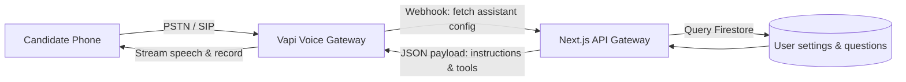

This page provides the configuration and developer setup details for integrating **Vapi**, our voice automation platform, which powers phone-in mock interview mocks.

---

## 1. Vapi Telephony System Architecture

In addition to web-based WebSockets, Mockrithm supports phone-based mock interviews. Candidates can request a call from the platform, which triggers Vapi to start a voice session.



---

## 2. Dynamic Assistant Configuration Payload

When Vapi initiates a call, it queries Mockrithm's webhook endpoint (`/api/vapi/assistant`) to load the interviewer persona and question scripts. Below is the JSON structure:

```json
{
  "name": "Mockrithm Technical Interviewer",
  "transcriber": {
    "provider": "deepgram",
    "model": "nova-2",
    "language": "en-US"
  },
  "model": {
    "provider": "openai",
    "model": "gpt-4o",
    "temperature": 0.3,
    "systemPrompt": "You are Rachel, a senior engineering interviewer. Ask one technical question at a time. Evaluate the candidate's answers based on the STAR methodology, and note filler words."
  },
  "voice": {
    "provider": "elevenlabs",
    "voiceId": "21m00Tcm4TlvDq8ikWAM"
  },
  "firstMessage": "Hello! I am Rachel, your interviewer today. Are you ready to begin the technical evaluation?",
  "silenceTimeoutSeconds": 10
}
```

---

## 3. Webhook Route Implementation

Here is the Next.js API endpoint (`app/api/vapi/webhook/route.ts`) designed to process call telemetry:

```typescript
import { NextResponse } from "next/server";
import { db } from "@/firebase/admin";

export async function POST(request: Request) {
  try {
    const body = await request.json();
    const { type, call, message } = body;

    // Verify webhook source using custom headers if configured
    
    switch (type) {
      case "assistant-request":
        // Dynamically fetch and return assistant config matching interview requirements
        return NextResponse.json({
          assistant: {
            systemPrompt: "Evaluate candidate communication skills...",
            firstMessage: "Welcome. Let's start the evaluation."
          }
        });

      case "call.status-update":
        if (call.status === "ended") {
          // Log call telemetry and duration to Firestore
          await db.collection("interviews").doc(call.id).set({
            durationSeconds: call.duration,
            status: "completed",
            recordingUrl: call.recordingUrl
          }, { merge: true });
        }
        break;

      default:
        break;
    }

    return NextResponse.json({ success: true });
  } catch (error) {
    console.error("Vapi webhook processor encountered an error:", error);
    return new NextResponse("Webhook error", { status: 500 });
  }
}
```

---

## 4. Webhook Event Types Reference

| Event Key (`type`) | Trigger Event | Mandatory Fields Required | Action Taken |
| :--- | :--- | :--- | :--- |
| `assistant-request` | Call initialized | `call.id` | Returns custom system prompts and voice IDs. |
| `call.status-update` | Call state transitions | `call.status`, `call.duration` | Updates active database records. |
| `transcript` | Speech transcribed | `transcript.text`, `transcript.speaker` | Appends dialogues to the active session transcript. |

<Callout type="info" title="Debugging Connection Logs">
Use the Vapi dashboard console to inspect SIP network latency and Deepgram transcription performance if you experience speech latency above `1500ms`.
</Callout>
