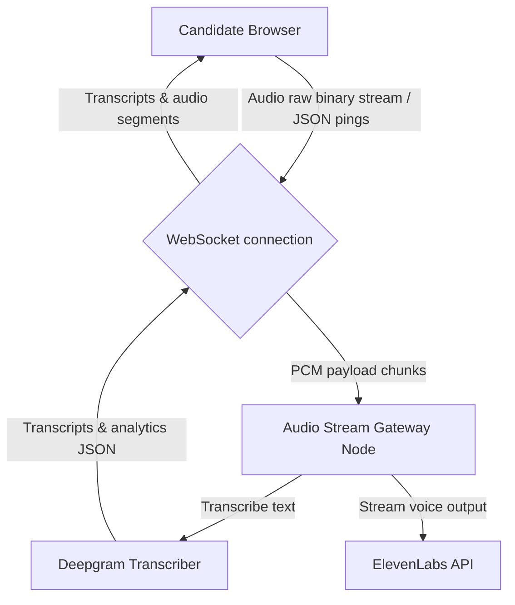

This page documents the full-duplex **WebSocket Audio Streaming Pipeline** used to coordinate real-time speech analytics and voice streaming in the Mockrithm interview console.

---

## 1. WebSockets Stream Architecture

The live interview interface connects directly to the audio gateway over `wss://`. This connection streams microphone audio chunks up to the server and retrieves synthesized voice audio segments along with real-time speech transcripts.



---

## 2. Protocol Specification & Event Payload Formats

All WebSocket communications utilize a structured JSON format containing event identifiers.

<Tabs items={['Connection Start', 'Binary Audio Payload', 'Live Transcription Data']}>
  <Tab value="Connection Start">
    ### Handshake Event: `start`
    Initialize the voice session and configure limits. Send this payload immediately on socket open:

    ```json
    {
      "event": "start",
      "streamSid": "session_abc123_unique",
      "voiceId": "eleven_rachel",
      "pacingLimit": {
        "min": 110,
        "max": 165
      }
    }
    ```
  </Tab>
  <Tab value="Binary Audio Payload">
    ### Binary Audio Event: `media`
    Microphone chunks must be formatted as raw PCM audio (16-bit, 16kHz, mono) and sent inside a base64 string container:

    ```json
    {
      "event": "media",
      "streamSid": "session_abc123_unique",
      "media": {
        "payload": "UklGRiSBAABXQVZFRm10IBAAAAABAAEAQB8AAEAfAAABAAgAZGF0YQ...",
        "timestamp": 17298647209
      }
    }
    ```
  </Tab>
  <Tab value="Live Transcription Data">
    ### Live Transcripts Event: `transcript`
    The server streams back transcription text along with vocal parameters:

    ```json
    {
      "event": "transcript",
      "text": "Actually, WebSockets support persistent full-duplex connections.",
      "speaker": "candidate",
      "analytics": {
        "wpm": 128,
        "fillers": ["actually"],
        "starMatched": ["situation"]
      }
    }
    ```
  </Tab>
</Tabs>

---

## 3. Client Implementation Reference

Below is the code to establish the WebSocket connection and stream audio arrays in a Next.js client component:

```typescript
export class AudioStreamClient {
  private socket: WebSocket | null = null;
  private audioContext: AudioContext | null = null;

  constructor(private streamSid: string, private onTranscript: (data: any) => void) {}

  public connect() {
    this.socket = new WebSocket("wss://api.mockrithm.me/v1/voice/stream");

    this.socket.onopen = () => {
      // 1. Send the start event payload
      this.socket?.send(JSON.stringify({
        event: "start",
        streamSid: this.streamSid,
        voiceId: "eleven_rachel",
        pacingLimit: { min: 110, max: 165 }
      }));
      this.initializeAudioRecording();
    };

    this.socket.onmessage = (event) => {
      const data = JSON.parse(event.data);
      if (data.event === "transcript") {
        this.onTranscript(data);
      }
    };
  }

  private async initializeAudioRecording() {
    const stream = await navigator.mediaDevices.getUserMedia({ audio: true });
    this.audioContext = new AudioContext({ sampleRate: 16000 });
    const source = this.audioContext.createMediaStreamSource(stream);
    const processor = this.audioContext.createScriptProcessor(4096, 1, 1);

    source.connect(processor);
    processor.connect(this.audioContext.destination);

    processor.onaudioprocess = (e) => {
      const inputData = e.inputBuffer.getChannelData(0);
      // Convert Float32Array to 16-bit PCM ArrayBuffer
      const pcmBuffer = this.convertToPCM16(inputData);
      
      if (this.socket && this.socket.readyState === WebSocket.OPEN) {
        this.socket.send(JSON.stringify({
          event: "media",
          streamSid: this.streamSid,
          media: {
            payload: Buffer.from(pcmBuffer).toString("base64"),
            timestamp: Date.now()
          }
        }));
      }
    };
  }

  private convertToPCM16(buffer: Float32Array): ArrayBuffer {
    const l = buffer.length;
    const buf = new Int16Array(l);
    for (let i = 0; i < l; i++) {
      buf[i] = Math.min(1, Math.max(-1, buffer[i])) * 0x7FFF;
    }
    return buf.buffer;
  }

  public disconnect() {
    this.socket?.close();
    this.audioContext?.close();
  }
}
```

---

## 4. Latency Mitigation & Recovery

<Accordions>
  <Accordion title="Handling Temporary Network Cuts">
    If the WebSocket connection drops during an active session, cache the base64 media chunks in a local buffer. On connection restoration, send a `reconnect` packet with the last successful payload timestamp to avoid losing speech data.
  </Accordion>
  <Accordion title="Speech Format Rules">
    Ensure the microphone stream sample rate is downsampled to exactly `16000Hz` before encoding to base64. Streaming high-resolution `44100Hz` stereo audio streams increases bandwidth requirements by **60%** without improving transcription accuracy.
  </Accordion>
</Accordions>
