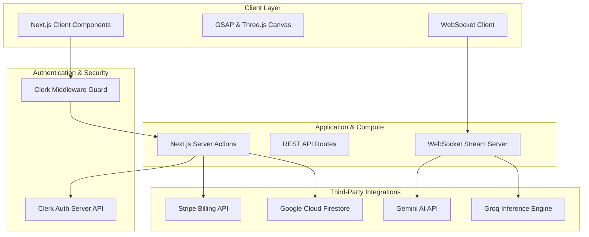

Welcome to the **Developer Documentation** for Mockrithm. This documentation hub serves as the single source of truth for engineering teams building, deploying, and maintaining the Mockrithm platform. 

Here you will find deep architectural blueprints, schema diagrams, core AI websocket pipeline configs, design system guidelines, and step-by-step instructions to initialize your local development workspace.

---

## 1. System Architecture Overview

Mockrithm utilizes a highly decoupled, dual-layer architecture built on **Next.js (App Router)**. This separates the public-facing marketing assets and static docs from the secure candidate workspace.

### Core Decoupling
1. **Layer 1: Public Marketing & SEO Docs Hub**
   - High-performance, statically generated landing pages and dynamic technical documentation.
   - Powered by **Fumadocs** to serve static MDX files with zero server load overhead.
   - Visually engaging transitions configured using GreenSock (GSAP) scroll pinning, Framer Motion, and Three.js canvas particle visualizers.
2. **Layer 2: Private Candidate Cockpit & Sandbox**
   - A highly secure app console guarded by **Clerk** authentication middleware.
   - Real-time interactive tools: ATS resume checklist builder, inline JSON Resume editor, WebSockets-based mock interview simulator.
   - Fast transactional persistence using Google Cloud Firestore.

<Callout type="info" title="System Data Flow">
When a user logs in, authentication tokens are validated by the Clerk SDK. All subsequent transactional data (resumes, interview configs, feedback history) is synced to Firestore. AI evaluations are routed via Groq and Gemini depending on latency requirements.
</Callout>

---

## 2. Directory Layout Blueprint

The codebase is organized into modular layers to promote maintainability and code-splitting. 

<FileTree>
  <FileTree.Folder name="app" defaultOpen>
    <FileTree.Folder name="(auth)" name="Clerk Login & Signup Routes" />
    <FileTree.Folder name="(root)" name="Dashboard & Pricing Views" />
    <FileTree.Folder name="admin" name="Operations panel & User management" />
    <FileTree.Folder name="api" name="REST & Webhook Route Handlers" />
    <FileTree.Folder name="documentation" name="Fumadocs Route [...slug]" />
  </FileTree.Folder>
  <FileTree.Folder name="components">
    <FileTree.Folder name="landing" name="Three.js & GSAP visualizers" />
    <FileTree.Folder name="resume" name="Parser & PDF Renderers" />
    <FileTree.Folder name="interview" name="WebSocket checkers & STAR checklists" />
  </FileTree.Folder>
  <FileTree.Folder name="content" defaultOpen>
    <FileTree.Folder name="docs">
      <FileTree.Folder name="dev" name="Developer Documentation MDX files" />
      <FileTree.Folder name="user" name="User Manual MDX files" />
    </FileTree.Folder>
  </FileTree.Folder>
  <FileTree.Folder name="firebase" name="Firestore config files" />
  <FileTree.Folder name="lib" name="Server Actions & Database Utilities" />
  <FileTree.File name="package.json" />
  <FileTree.File name="source.config.ts" />
</FileTree>

---

## 3. Technology Stack & Key Integrations

Below is a breakdown of the primary technology choices powering the Mockrithm application:

<Cards>
  <Card title="Next.js (App Router)" description="Powers SSR/ISR pages, Server Actions, API routes, and static docs generation." href="https://nextjs.org" />
  <Card title="Firebase Firestore" description="NoSQL database utilized for storing user states, resumes, and interview telemetry." href="https://firebase.google.com" />
  <Card title="Clerk Auth" description="Handles secure user identity, session management, and subdomain forwarding routing." href="https://clerk.com" />
  <Card title="Stripe Payments" description="Manages pricing tiers, client subscriptions, checkout workflows, and webhook validation." href="https://stripe.com" />
</Cards>

---

## 4. Key Platform Features

<Accordions>
  <Accordion title="ATS Resume Analyzer & Editor">
    Provides real-time scoring of resumes using parser-friendly single-column styling. The system checks resumes for:
    - **Formatting Glitches:** Finds complex double-column styles or non-parseable tables.
    - **Keywords Matching:** Compares candidate skills against job descriptions.
    - **PDF Exporting:** Generates high-fidelity, parser-optimized CV documents on-the-fly.
  </Accordion>
  <Accordion title="WebSocket Mock Interview Engine">
    Connects candidates to low-latency AI interviewers:
    - **STAR Checklists:** Ticks off Situation, Task, Action, and Result checkpoints automatically using speech transcripts.
    - **WPM Analytics:** Tracks words-per-minute pacing.
    - **Filler Audits:** Flags occurrences of vocal halts (e.g., *um*, *ah*, *like*).
  </Accordion>
  <Accordion title="Admin Operations Console">
    Allows admins to manage platform health:
    - **User Administration:** Controls roles, sets custom Stripe pricing plan limits, and deletes accounts.
    - **Audits & Telemetry:** Monitors system feedback records and user reviews.
    - **Blog Engine:** Publishes blog posts directly to Firestore collections.
  </Accordion>
</Accordions>

---

## 5. Next Steps

To get started, follow our comprehensive technical guides:

<Steps>
  <Step>
    ### [Developer Introduction](/documentation/dev/intro)
    Understand the business logic, goals, and architectural philosophies.
  </Step>
  <Step>
    ### [Local Quickstart Guide](/documentation/dev/quickstart)
    Install dependencies, mock services, and spin up your development server.
  </Step>
  <Step>
    ### [Production Deployment](/documentation/dev/deploy)
    Configure subdomains, build settings, and environment maps on Vercel and Firebase.
  </Step>
</Steps>
