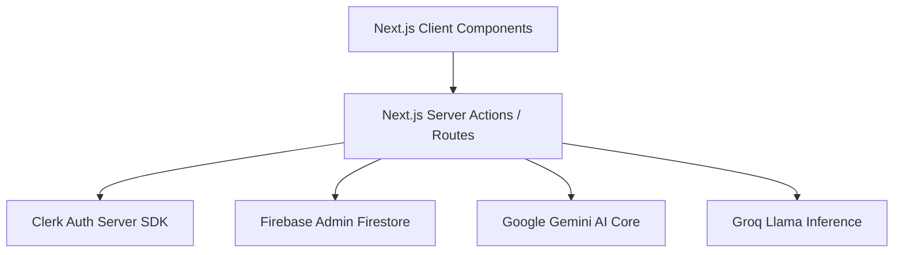

Welcome to the **Developer Documentation**! This section contains structural guides on Mockrithm's system architecture, API definitions, integrations, and local development configurations.

## System Architecture

Mockrithm is built using a modern, scalable web architecture utilizing Next.js (App Router), Clerk, Firebase, and AI Inference APIs.



### Core Technologies
- **Frontend Framework:** Next.js (version 16) with React 19.
- **Styling System:** Tailwind CSS for structured, utility-first UI styling.
- **Authentication & Roles:** Clerk Next.js SDK handles authentication, user profile tokens, and multi-tenant proxy subdomains.
- **Database & Persistence:** Google Cloud Firestore (via Firebase Admin SDK) stores user workspace data, resumes, telemetry logs, and mock interview reports.
- **AI Core Engines:** 
  - *Google Gemini AI API:* Handles complex ATS analysis, semantic resumes suggestions, and interview feedback structures.
  - *Groq Inference API:* Powers fast, low-latency LLM responses during real-time mock interviews.

---

## Local Development Configuration

Follow these steps to set up and run the platform in your local workspace:

### 1. Project Setup & Installation
Clone the repository and install all dependencies:
```bash
git clone https://github.com/RoaraxAli/Mockrithm.git
cd Mockrithm
npm install
```

### 2. Environment Configuration
Create a `.env` file in the root directory and configure the required keys:

```ini
# Clerk Authentication Keys
NEXT_PUBLIC_CLERK_PUBLISHABLE_KEY=your_publishable_key
CLERK_SECRET_KEY=your_secret_key

# Firebase Configuration
FIREBASE_PROJECT_ID=your_firebase_project_id
FIREBASE_CLIENT_EMAIL=your_client_email
FIREBASE_PRIVATE_KEY="your_private_key"

# AI Inference Keys
GEMINI_API_KEY=your_gemini_api_key
GROQ_API_KEY=your_groq_api_key
```

### 3. Running Local Servers
Start the Next.js development server:
```bash
npm run dev
```
The application will be accessible at [http://localhost:3000](http://localhost:3000).
