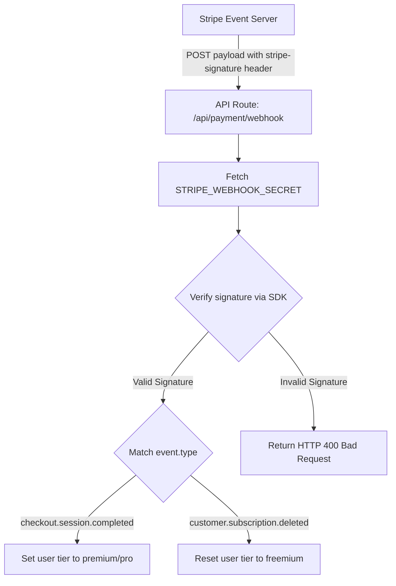

This page documents the security and processing pipeline for **Stripe Webhook** event handling inside the Mockrithm platform.

---

## 1. Webhook Verification Pipeline

Webhooks are critical to asynchronous order updates. Since anyone can ping public REST endpoints, the server must verify the authenticity of the incoming webhook payload before upgrading user roles or tiers.



---

## 2. API Webhook Route Implementation

Here is the implementation code for signature verification and event routing (`app/api/payment/webhook/route.ts`):

```typescript
import { NextRequest, NextResponse } from "next/server";
import { db } from "@/firebase/admin";
import Stripe from "stripe";

const stripe = new Stripe(process.env.STRIPE_SECRET_KEY!, {
  apiVersion: "2023-10-16" as any,
});

const endpointSecret = process.env.STRIPE_WEBHOOK_SECRET!;

export async function POST(request: NextRequest) {
  const body = await request.text();
  const signature = request.headers.get("stripe-signature");

  if (!signature) {
    return new NextResponse("Missing signature header", { status: 400 });
  }

  let event: Stripe.Event;

  // 1. Verify webhook signature
  try {
    event = stripe.webhooks.constructEvent(body, signature, endpointSecret);
  } catch (err: any) {
    console.error(`Webhook signature verification failed: ${err.message}`);
    return new NextResponse(`Verification Error: ${err.message}`, { status: 400 });
  }

  // 2. Route events to process
  try {
    switch (event.type) {
      case "checkout.session.completed": {
        const session = event.data.object as Stripe.Checkout.Session;
        const userId = session.metadata?.userId;
        const stripeCustomerId = session.customer as string;

        if (userId) {
          // Retrieve the subscription details to check tier parameters
          const subscription = await stripe.subscriptions.retrieve(session.subscription as string);
          const priceId = subscription.items.data[0].price.id;

          // Determine the user's tier based on Stripe Price IDs
          let tier = "premium";
          if (priceId === process.env.STRIPE_PRO_PRICE_ID) {
            tier = "pro";
          }

          // Update candidate profile inside Firestore
          await db.collection("users").doc(userId).set({
            tier: tier,
            stripeCustomerId: stripeCustomerId,
            stripeSubscriptionId: session.subscription as string,
            updatedAt: new Date().toISOString()
          }, { merge: true });
        }
        break;
      }

      case "customer.subscription.deleted": {
        const subscription = event.data.object as Stripe.Subscription;
        // Search Firestore for the user matching this subscription ID
        const userSnapshot = await db
          .collection("users")
          .where("stripeSubscriptionId", "==", subscription.id)
          .limit(1)
          .get();

        if (!userSnapshot.empty) {
          const userDoc = userSnapshot.docs[0];
          await userDoc.ref.set({
            tier: "freemium", // Demote back to free tier on cancellation
            stripeSubscriptionId: null,
            updatedAt: new Date().toISOString()
          }, { merge: true });
        }
        break;
      }

      default:
        console.log(`Unhandled Stripe event type: ${event.type}`);
    }

    return NextResponse.json({ received: true });

  } catch (error) {
    console.error("Webhook processing error:", error);
    return new NextResponse("Internal database processing error", { status: 500 });
  }
}
```

---

## 3. Mandatory Environment Secrets

<Callout type="warn" title="Local Testing Secret Keys">
During local testing using the Stripe CLI (`stripe listen --forward-to localhost:3000/api/payment/webhook`), the CLI console will output a dynamic webhook signing secret (`whsec_...`). You must update your local `.env` file with this secret to prevent verification failures.
</Callout>

- **Production Setup:** Navigate to your **Stripe Dashboard > Developers > Webhooks** to add your production URL and copy the official Webhook signing secret.
- **Event Limits:** Only configure webhooks to receive necessary events (like `checkout.session.completed` and `customer.subscription.deleted`) to minimize server workloads.
