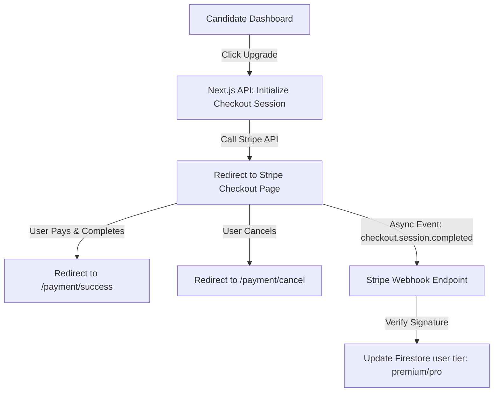

This page documents the integration of **Stripe** payment gateways inside Mockrithm to manage subscriptions and pricing plans.

---

## 1. Checkout & Monetization Flow

Mockrithm utilizes Stripe Checkout to process subscription upgrades. 



---

## 2. Stripe Session Initialization Implementation

Below is the implementation code for initializing a Stripe Checkout session (`app/api/payment/session/route.ts`):

```typescript
import { NextRequest, NextResponse } from "next/server";
import { auth } from "@clerk/nextjs/server";
import Stripe from "stripe";

const stripe = new Stripe(process.env.STRIPE_SECRET_KEY!, {
  apiVersion: "2023-10-16" as any,
});

export async function POST(request: NextRequest) {
  try {
    const { userId } = await auth();
    if (!userId) {
      return new NextResponse("Unauthorized request", { status: 401 });
    }

    const { priceId } = await request.json();
    if (!priceId) {
      return NextResponse.json({ error: "Missing priceId parameter" }, { status: 400 });
    }

    // Initialize Stripe Checkout session
    const session = await stripe.checkout.sessions.create({
      payment_method_types: ["card"],
      line_items: [
        {
          price: priceId,
          quantity: 1,
        },
      ],
      mode: "subscription",
      success_url: `${process.env.NEXT_PUBLIC_APP_URL}/payment/success?session_id={CHECKOUT_SESSION_ID}`,
      cancel_url: `${process.env.NEXT_PUBLIC_APP_URL}/payment/cancel`,
      metadata: {
        userId: userId, // Pass Clerk ID to match in webhook callback
      },
    });

    return NextResponse.json({ url: session.url });

  } catch (error) {
    console.error("Failed to initialize checkout session:", error);
    return NextResponse.json({ error: "Checkout session initialization failed" }, { status: 500 });
  }
}
```

---

## 3. Product & Price Mapping IDs

Configure your local environment and Stripe product catalogs using the parameters below:

| Plan Tier | Price ID Parameter (Stripe Console) | Monthly Cost | Platform Capabilities Unlocked |
| :--- | :--- | :--- | :--- |
| **Freemium** | Default (`null`) | `$0/mo` | 1 AI voice session, basic pacing analysis. |
| **Premium** | `price_1PzExamplePremium` | `$10/mo` | Unlimited voice sessions, filler word audits, and ATS checker reports. |
| **Pro** | `price_1PzExamplePro` | `$25/mo` | Custom resume templates, resume exports, and API keys. |

---

## 4. Security & Best Practices

<Callout type="warn" title="Metadata Tracking">
Always include the candidate's authenticated Clerk `userId` inside the Stripe Checkout session `metadata` properties. When the asynchronous webhook payload arrives, the system uses this ID to identify which user profile to upgrade.
</Callout>

<Accordions>
  <Accordion title="Customer Billing Portal">
    To allow users to cancel or update payment methods, integrate Stripe's Customer Portal API:
    ```typescript
    const portalSession = await stripe.billingPortal.sessions.create({
      customer: stripeCustomerId,
      return_url: `${process.env.NEXT_PUBLIC_APP_URL}/settings`,
    });
    ```
  </Accordion>
  <Accordion title="Idempotency Settings">
    To prevent duplicate subscription entries, pass an `idempotencyKey` inside your Stripe API calls during checkout session creations.
  </Accordion>
</Accordions>
