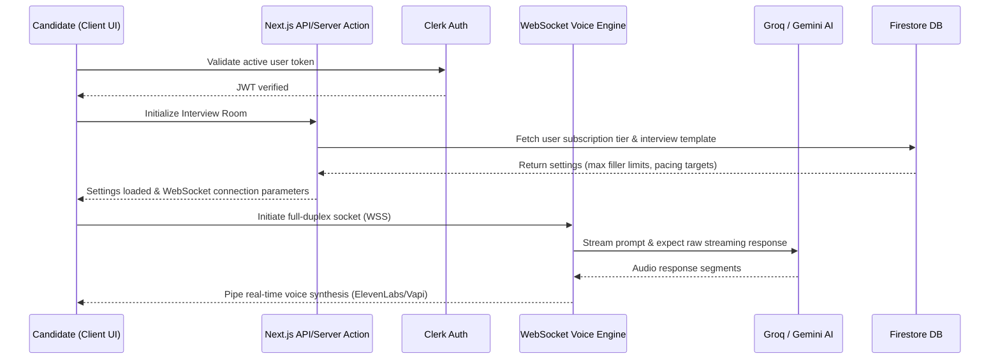

Welcome to the architectural blueprints for **Mockrithm**. Mockrithm is a high-performance, AI-driven career readiness platform designed to evaluate and coach candidates through automated, low-latency mock interviews, and optimize their profiles through real-time ATS resume checkers.

---

## 1. Architectural Philosophy

Mockrithm is designed with three main principles:
- **Decoupled User Spaces:** Separate public marketing assets from the high-throughput, protected candidate cockpit to prevent load spikes from affecting core features.
- **Low Latency Feedback Loops:** Real-time metrics (like filler word audit, WPM, and STAR checkpoints) must be parsed in sub-second frames.
- **Fail-safe Integrations:** When premium speech synthesis or websocket connections degrade, fallback strategies should instantly preserve the session state.

---

## 2. Platform Architecture Layers

Mockrithm splits its workspace into three layers:

<Tabs items={['Public Layer', 'Candidate Workspace', 'Admin Console']}>
  <Tab value="Public Layer">
    ### Layer 1: Marketing & Documentation
    - **Purpose:** Serve landing pages, blog entries, pricing configurations, and static documentation.
    - **Optimization:** Rendered statically using Next.js Incremental Static Regeneration (ISR) and Fumadocs.
    - **Interactive Features:** 
      - High-end WebGL graphics powered by **Three.js** canvas components.
      - Smooth-scrolling animations managed by **Lenis** and **GSAP** pinned triggers.
  </Tab>
  <Tab value="Candidate Workspace">
    ### Layer 2: Private Interactive Workspace
    - **Purpose:** Provide authenticated sandbox features for mock interviews and resume formatting.
    - **Auth Guards:** Restricts layout wrappers via **Clerk** middleware rules.
    - **Interactive Tools:**
      - **WebSocket Mock Interview Console:** Custom full-duplex WebSocket stream to pipe audio arrays.
      - **ATS Resume Workspace:** Interactive workspace using JSON resume structure and instant PDF compilers.
  </Tab>
  <Tab value="Admin Console">
    ### Layer 3: System Administration Controls
    - **Purpose:** Give administrators tools to monitor platform telemetry and perform operations.
    - **Controls:**
      - **Database Administration:** View active users, modify subscription plan metadata, and purge test data.
      - **Audit & Review:** Analyze audio calibration logs and aggregated feedback records.
      - **Blog CMS:** Manage and publish markdown blog entries directly to Firestore.
  </Tab>
</Tabs>

---

## 3. High-Level Core Subsystem Communication

Here is how the core systems coordinate actions when a candidate initiates a mock interview:

---

## 4. API Endpoints Reference

<Callout type="info" title="API Gateway Address">
By default, developer sandboxes target `sandbox.api.mockrithm.me` with sandbox tokens. Production pipelines leverage sharded cloud nodes matching `api.mockrithm.me`.
</Callout>

### Core Endpoints

| Endpoint | Method | Authentication | Purpose |
| :--- | :--- | :--- | :--- |
| `/api/auth/sync` | `POST` | Clerk Session Token | Synchronizes newly registered Clerk user profiles to Firestore collections. |
| `/api/resume/parse` | `POST` | Bearer JWT | Parses uploaded PDF documents and returns structured JSON schema values. |
| `/api/resume/autofix` | `POST` | Bearer JWT | Runs Google Gemini optimizations to fix spacing and ATS keyword gaps. |
| `/api/payment/session` | `POST` | Bearer JWT | Initializes Stripe Checkout session based on selected pricing plans. |

---

## 5. Security & Isolation Controls

To protect candidate resumes and platform integrations, Mockrithm enforces strict rules:
1. **Middleware Verification:** Clerk guards check all active sessions before permitting access to Server Actions or API routes.
2. **Database Security Rules:** Firestore security rules guarantee that candidates can read and modify only documents matching their authenticated Clerk `userId`.
3. **Secret Masking:** Keys (like `FIREBASE_PRIVATE_KEY` and `GEMINI_API_KEY`) are stored in secure environments and are never exposed to client bundles.
