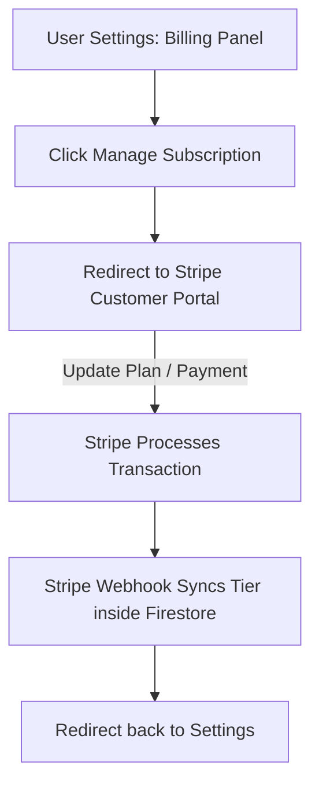

This page provides an overview of Mockrithm's subscription plans and billing settings.

---

## 1. Subscription Tiers Comparison

Mockrithm offers three plans to fit your interview prep needs:

| Plan Tier | Price (Monthly) | Optimal For | Key Capabilities Unlocked |
| :--- | :--- | :--- | :--- |
| **Freemium** | `$0/mo` | Basic test usage | 1 AI voice session, basic pacing analysis. |
| **Premium** | `$10/mo` | Standard prep | Unlimited voice sessions, filler word audits, and ATS checker reports. |
| **Pro** | `$25/mo` | Advanced prep | Custom resume templates, resume exports, and API keys. |

---

## 2. Dynamic Plan Capabilities Details

Each tier unlocks specific platform resources:

<Tabs items={['Freemium Features', 'Premium Features', 'Pro Features']}>
  <Tab value="Freemium Features">
    ### Freemium (Tier 1)
    - **Session Limit:** 1 AI voice session per month.
    - **Resume Builders:** Standard single-column templates.
    - **Analytics:** Basic words-per-minute (WPM) check report.
  </Tab>
  <Tab value="Premium Features">
    ### Premium (Tier 2)
    - **Session Limit:** Unlimited mock interview sessions.
    - **Voice Audits:** Full vocal filler scans (*um*, *ah*, *like*).
    - **STAR checklists:** Real-time STAR method matching.
    - **ATS Checker:** Scan resume text against target job descriptions.
  </Tab>
  <Tab value="Pro Features">
    ### Pro (Tier 3)
    - **API Keys:** Export transcripts and metrics to third-party endpoints.
    - **Templates Workspace:** Full access to standard resume layouts.
    - **Priority Inference:** Priority routing to the primary Groq engine.
  </Tab>
</Tabs>

---

## 3. Subscription Management Workflow

You can upgrade, downgrade, or cancel your subscription plan at any time through the billing dashboard:

<Callout type="info" title="Annual Billing Discounts">
Choose annual billing options to save **20%** compared to monthly subscription renewals.
</Callout>
