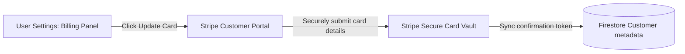

This page explains how to update, manage, and remove your payment methods.

---

## 1. Billing Security & Portals

Mockrithm does not store your credit card details. All transactions and card details are managed securely on Stripe's PCI-compliant servers.

---

## 2. Step-by-Step Payment Method Updates

Follow these steps to update your payment cards:

<Steps>
  <Step>
    ### Open Billing Settings
    Navigate to your **User Dashboard > Account Settings > Billing & Subscriptions**.
  </Step>
  <Step>
    ### Open Stripe Customer Portal
    Click the **Update Payment Method** button. The application redirects you to your secure Stripe billing console.
  </Step>
  <Step>
    ### Manage Payment Methods
    In the Stripe portal, you can:
    - **Add a new card:** Input a credit card or debit card.
    - **Set default card:** Mark a card as the primary payment method for renewals.
    - **Delete a card:** Remove old payment cards.
  </Step>
  <Step>
    ### Return to Dashboard
    Once updated, click **Return to Application** to redirect back to your Mockrithm workspace.
  </Step>
</Steps>

---

## 3. Supported Payment Options

| Payment Option | Support Status | Processing Speeds |
| :--- | :--- | :--- |
| **Credit & Debit Cards** | Fully Supported | Instant activation |
| **Apple Pay / Google Pay** | Fully Supported | Instant activation |
| **Bank Transfers** | Supported (Annual invoices only) | 3-5 business days |

<Callout type="info" title="Renewal Invoices">
Primary subscription payments are charged to your default card automatically at the start of each billing cycle.
</Callout>
