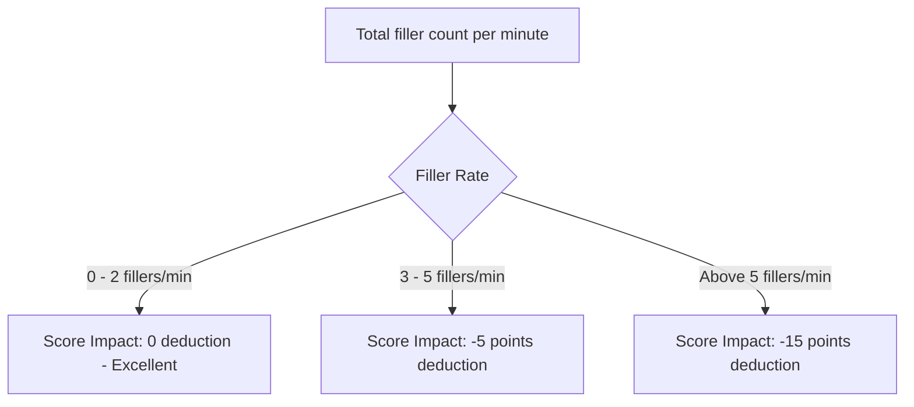

This page documents how Mockrithm detects and grades vocal filler words during your mock interviews.

---

## 1. What are Vocal Fillers?

Vocal fillers are placeholder words or sounds used to fill pauses in speech (e.g. *um*, *ah*, *like*, *basically*, *actually*). While natural in casual conversation, excessive use of filler words in interviews can make answers feel unprepared or less confident.

---

## 2. Tracked Filler Words

The articulation engine monitors your speech for these common filler words:

| Filler Word | Typical Cause | Articulation Impact | Suggested Alternative |
| :--- | :--- | :--- | :--- |
| **"Um" / "Ah"** | Formulating the next sentence | High | Pause silently for a second instead of making a sound. |
| **"Like"** | Transitioning between ideas | Medium | Use structured transition phrases (e.g., *"Furthermore"*, *"Specifically"*). |
| **"Basically"** | Simplifying explanations | Low | State the main point directly without prefacing it. |
| **"Actually"** | Correcting statements | Low | State the corrected details directly and clearly. |

---

## 3. Scoring Impact Calculation

The articulation engine tracks your total filler word count and updates your score based on these thresholds:

---

## 4. Tips to Reduce Filler Words

<Accordions>
  <Accordion title="Embrace the Silent Pause">
    Instead of saying *"um"* or *"like"* while gathering your thoughts, pause silently. A brief pause projects confidence and gives you time to structure your next sentence.
  </Accordion>
  <Accordion title="Pace Your Speech">
    Speaking slightly slower (aiming for the `120-130 WPM` range) gives your brain more time to formulate thoughts, reducing the urge to use filler words.
  </Accordion>
</Accordions>
