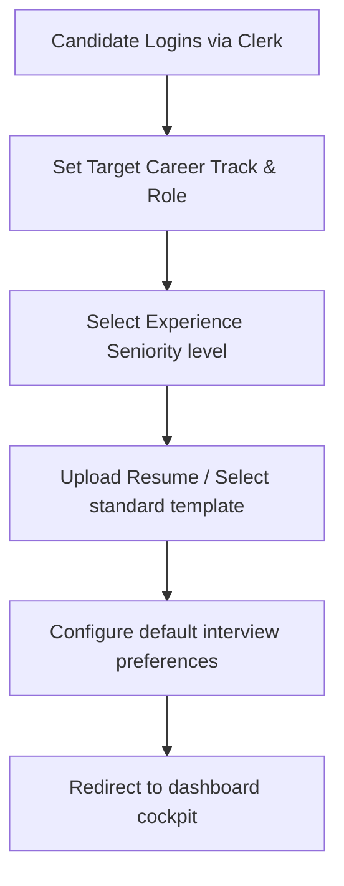

This page provides a detailed walkthrough of the onboarding and profile initialization process for new Mockrithm candidates.

---

## 1. Onboarding Workflow Overview

When you first log in to your account, Mockrithm guides you through a setup wizard. This process configures the platform to match your career goals and target roles.

---

## 2. Step-by-Step Profile Configuration

Follow these steps to complete your initial profile configuration:

<Steps>
  <Step>
    ### Choose Your Career Track & Target Role
    Specify your target role and industry (e.g. *Frontend Engineer*, *Product Manager*, *Data Analyst*). 
    
    <Callout type="info" title="AI Targeting">
      The voice interview engine uses your target role to select technical questions, scenarios, and coding challenges.
    </Callout>
  </Step>
  <Step>
    ### Specify Your Seniority level
    Select your current professional experience level:
    - **Junior:** Focuses on core technical skills and basic behavioral templates.
    - **Mid:** Emphasizes component ownership and team collaboration scenarios.
    - **Senior / Lead:** Focuses on architectural trade-offs, system design scaling, and leadership.
  </Step>
  <Step>
    ### Initialize Your Resume Workspace
    You have two options to set up your resume:
    - **Upload existing CV (PDF):** The parser extracts your work history and compiles it into the workspace automatically.
    - **Select standard template:** Start with a blank template designed to satisfy ATS formats.
  </Step>
  <Step>
    ### Calibrate Default Settings
    Set your target pacing limits (words-per-minute) and choose your preferred AI voice persona.
  </Step>
</Steps>

---

## 3. Account Settings Reference

You can update these preferences at any time in the **User Settings** panel:

<Accordions>
  <Accordion title="Updating Career Tracks">
    If you change target roles, update your track in the settings page. Subsequent mock interviews will adapt to your new role target automatically.
  </Accordion>
  <Accordion title="Clerk Profile Sync">
    Your login credentials, email, and profiles are managed securely by Clerk. Changes to your password or profile picture are updated in Mockrithm dynamically.
  </Accordion>
</Accordions>
