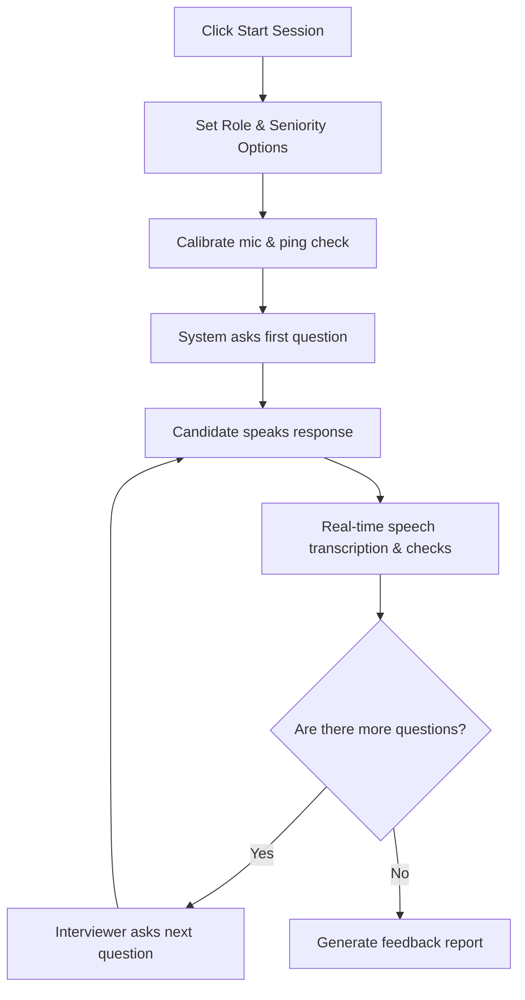

This page guides you through setting up and running a voice-based mock interview on Mockrithm.

---

## 1. Interview Workflow Overview

Mockrithm's mock interviews simulate a live conversation with an engineering manager or interviewer. The AI asks questions, listens to your answers, and updates progress indicators as you speak.

---

## 2. Dynamic Setup Setup

Before starting, configure your interview settings to match your current prep goals:

<Accordions>
  <Accordion title="Interviewer Persona Configuration">
    - **Rachel (Standard):** Focuses on technical breadth and clean communication pacing. Useful for standard coding or system design preps.
    - **Dom (Strict):** Interrupts with clarifying questions and technical follow-ups. Useful for preparing for stress-interviews or senior loops.
    - **Clyde (Behavioral):** Evaluates culture alignment, project management, and leadership scenarios.
  </Accordion>
</Accordions>

---

## 3. Step-by-Step Session Walkthrough

Follow these steps to complete a voice interview session:

<Steps>
  <Step>
    ### Start Calibration
    Open the interview panel and click **Calibrate Microphone**. Speak a few test sentences to check input volumes and network latency.
  </Step>
  <Step>
    ### Allow Microphone Access
    When prompted by your browser, select **Allow** to give the platform access to your microphone.
    
    <Callout type="info" title="Browser Settings">
      If you decline the permissions prompt by mistake, click the lock icon in your browser address bar to reset permission settings.
    </Callout>
  </Step>
  <Step>
    ### Answer Questions
    Speak clearly at a natural pace. Avoid long pauses, as the voice engine detects silence to determine when you have finished your response.
  </Step>
  <Step>
    ### Complete and Review Feedback
    When the interviewer finishes asking all questions, click **Finalize Session**. The system will process the transcript and redirect you to the performance scorecard.
  </Step>
</Steps>

---

## 4. Tips for High Accuracy

- **Avoid Speaking Over the AI:** Wait for the AI interviewer to finish speaking completely before beginning your answer.
- **Minimize Background Noise:** Close open tabs, silence mobile phones, and use a headset to reduce room echo.
