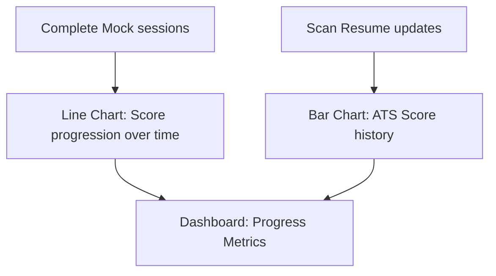

This page explains how to review your interview score sheets and resume feedback reports on the Mockrithm dashboard.

---

## 1. Navigating Your Reports Hub

Your dashboard stores a history of all completed interviews and resume reviews.

<Cards>
  <Card title="Mock Interview Logs" description="Review audio recordings, transcripts, and vocal diagnostics for each question." href="/documentation/user/scores" />
  <Card title="ATS Resume Scores" description="Inspect formatting suggestions, missing keywords, and project suggestions." href="/documentation/user/resumes" />
</Cards>

---

## 2. Reviewing Interview Score Sheets

Each mock interview report is split into three main tabs:

<Tabs items={['Scorecard Overview', 'Dialogue Transcript', 'AI Insights']}>
  <Tab value="Scorecard Overview">
    ### Performance Scorecard
    - Displays your overall score (out of 100).
    - Breaks down scores for **Vocal Pacing** and **Filler Word Counts**.
    - Displays a timeline mapping your pacing throughout the interview.
  </Tab>
  <Tab value="Dialogue Transcript">
    ### Interactive Dialogue Transcript
    - Shows a complete transcript of the conversation.
    - Highlighted terms flag filler words and STAR components.
    - Click any section of the transcript to play the corresponding audio recording.
  </Tab>
  <Tab value="AI Insights">
    ### Strengths & Areas for Improvement
    - **Strengths:** Highlights areas where your answers excelled (e.g. structured STAR usage).
    - **Improvement Areas:** Offers suggestions to refine your answers (e.g. adding metrics, expanding actions).
  </Tab>
</Tabs>

---

## 3. Tracking Score Trends

The dashboard charts your progress over time to show how your skills improve with practice:

<Callout type="info" title="Sharing Reports">
You can export reports to PDF or generate shareable links to send to mentors or peers for review.
</Callout>
