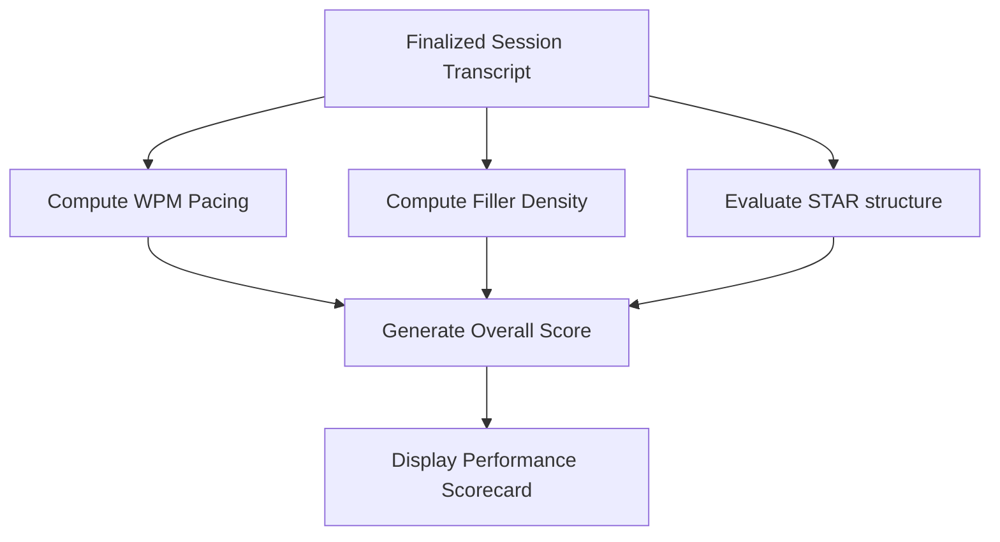

This page explains how Mockrithm calculates your scores for mock interviews and resume reviews.

---

## 1. Interview Evaluation Criteria

Your overall mock interview score (out of 100) is calculated across three main communication metrics:

| Metric | Target / Optimal Range | Evaluation Goal | Weight |
| :--- | :--- | :--- | :--- |
| **Vocal Pacing** | `110 - 150 WPM` | Tracks your speaking speed. | 25% |
| **Vocal Fillers** | `< 3 occurrences/min` | Flags placeholder words (like *um*, *ah*, *like*). | 25% |
| **STAR Structuring** | `> 85% Match` | Confirms your response covers Situation, Task, Action, and Result. | 50% |

---

## 2. Dynamic Performance Scorecard

Once you finalize a session, the dashboard displays your results in a structured scorecard:

---

## 3. Resume Grading Scales (ATS Score)

Mockrithm also scores uploaded resumes to check their compatibility with Applicant Tracking Systems (ATS):

<Accordions>
  <Accordion title="ATS Score Grading Criteria">
    - **Formatting Checks (30%):** Scans for double-column layouts, complex tables, or custom graphics that can cause parser errors.
    - **Keyword Matching (40%):** Scans the skills and work experience sections for keywords that match target job descriptions.
    - **Content Depth (30%):** Verifies that bullet points focus on achievements and use active verbs.
  </Accordion>
</Accordions>

---

## 4. Tips for Improving Scores

- **Review Previous Scorecards:** Compare your scores over time on the user dashboard to track progress.
- **Listen to Your Recordings:** Use the audio player on completed feedback reports to review your pacing and filler word usage.
