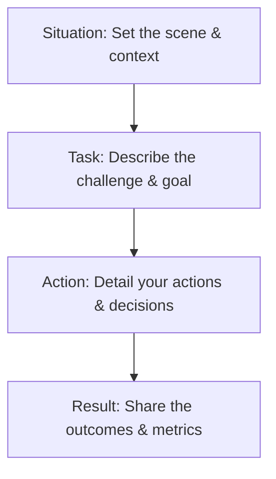

This page provides a guide on how to structure your answers using the **STAR methodology** to maximize your scores on Mockrithm.

---

## 1. The STAR Method Components

The STAR method helps you structure your answers to behavioral questions, ensuring you cover all key details clearly:

- **Situation (15%):** Describe the context of the project or challenge. Keep it concise.
- **Task (15%):** Explain your responsibilities and the goal you needed to achieve.
- **Action (45%):** Detail the steps you took to resolve the challenge. Focus on your individual contributions.
- **Result (25%):** Share the outcomes of your actions. Include quantitative metrics (e.g. time saved, revenue generated) where possible.

---

## 2. Comparison: Good vs. Bad Structuring

Review these examples to understand how to structure your answers effectively:

<Tabs items={['Structured Response (Recommended)', 'Unstructured Response']}>
  <Tab value="Structured Response (Recommended)">
    ### STAR Structuring Example:
    
    > **Situation:** *"At my last company, our page-load times were slow, causing a 12% drop in user conversions."*
    > 
    > **Task:** *"My task was to optimize our Next.js frontend to reduce load times by at least 30%."*
    > 
    > **Action:** *"I audited our page bundles, implemented dynamic code-splitting, configured image optimization pipelines, and migrated our database queries to Edge routes."*
    > 
    > **Result:** *"As a result, we reduced page-load times by 42% and recovered 10% of lost user conversions."*
    
    <Callout type="success" title="High Score Assessment">
      This response covers all four STAR stages, uses first-person singular action verbs (*"I audited"*, *"I configured"*), and provides clear quantitative outcomes (*"42% reduction"*, *"10% recovery"*).
    </Callout>
  </Tab>
  <Tab value="Unstructured Response">
    ### Poor Structuring Example:
    
    > *"We had a really slow website, and users were unhappy. So we worked as a team to fix it. We spent a few weeks working on imports and database queries. In the end, the site felt faster and users were happier."*
    
    <Callout type="error" title="Low Score Assessment">
      This response lacks clear structure, uses vague descriptions (*"felt faster"*), and fails to outline the speaker's individual contributions (*"We worked"* instead of *"I did"*).
    </Callout>
  </Tab>
</Tabs>

---

## 3. Best Practices for STAR Answers

- **Allocate Time Wisely:** Spend most of your time on the **Action** phase to explain how you solve problems.
- **Use Numbers:** Always try to include a quantitative result (e.g. *%-improvements*, *hours saved*) in the **Result** phase.
- **Focus on Your Contributions:** Use *"I"* rather than *"We"* to highlight your own decisions and actions.
