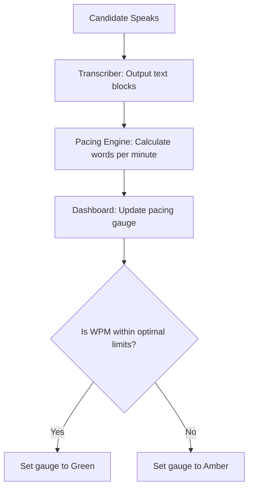

This page documents how Mockrithm tracks and evaluates your speaking speed in Words-Per-Minute (WPM) during mock interviews.

---

## 1. Why Vocal Pacing Matters

Speaking speed has a major impact on communication scores. 
- **Too Fast:** Can make it difficult for the interviewer to follow complex arguments or system designs.
- **Too Slow:** Can make answers feel hesitant and project a lack of confidence.

---

## 2. Words-Per-Minute (WPM) Targets

The pacing engine categorizes speaking speed using these ranges:

| Pacing Range (WPM) | Status | Assessment | Recommended Action |
| :--- | :--- | :--- | :--- |
| **Below 110 WPM** | Slow | Low articulation speed | Try to speak slightly faster to keep the interviewer engaged. |
| **110 - 150 WPM** | **Optimal** | Professional pacing | Perfect speed! Maintain this pacing in live interviews. |
| **Above 150 WPM** | Fast | Rushed delivery | Slow down. Pause between key sentences to project confidence. |

---

## 3. Real-Time Tracking Architecture

As you speak, the system downsamples your microphone inputs, transcribes the speech, and calculates your pacing speed dynamically:

---

## 4. Tips for Improving Pacing

<Accordions>
  <Accordion title="How to Deal with Fast Speaking">
    If your score consistently exceeds `150 WPM`, practice pausing between sentences. Take a breath when transitioning between sections of your answer.
  </Accordion>
  <Accordion title="Using the STAR Framework to Steady Pacing">
    Structure your responses using the STAR method. Allocating distinct phases for **Situation**, **Task**, **Action**, and **Result** helps structure your thoughts, making it easier to maintain a steady pacing speed.
  </Accordion>
</Accordions>
