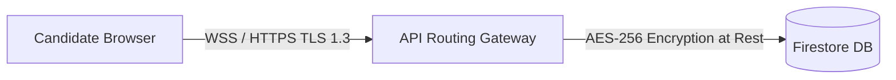

This page documents Mockrithm's security practices, data encryption standards, and user privacy protections.

---

## 1. Security Overview

We enforce strict data controls to protect your personal details, resumes, and interview recordings:

- **Data Isolation:** Candidates can access only their own files and reports, enforced by secure database rules.
- **Microphone Security:** The voice interview engine accesses your microphone only during active interview sessions. The microphone stream is deactivated automatically when a session ends.
- **External APIs:** Transcripts are sent to API partners (like Groq, ElevenLabs, and Google) using secure, authenticated connections.

---

## 2. Encryption Standards

We implement encryption to protect your data both in transit and at rest:

| State | Encryption Protocol | Objective |
| :--- | :--- | :--- |
| **In Transit** | TLS 1.3 / HTTPS / WSS | Protects microphone streams and resume uploads from intercept. |
| **At Rest** | AES-256 Bit Encryption | Protects stored resumes, transcripts, and telemetry files. |

---

## 3. Data Control Options

We provide tools to manage your data privacy:

<Accordions>
  <Accordion title="Exporting Your Data">
    You can export your resume as a JSON file at any time to port your data to other platforms.
  </Accordion>
  <Accordion title="Deleting Your Account">
    Requesting account deletion purges all your data (resumes, audio recordings, and transcripts) from our database within 24 hours.
  </Accordion>
</Accordions>
