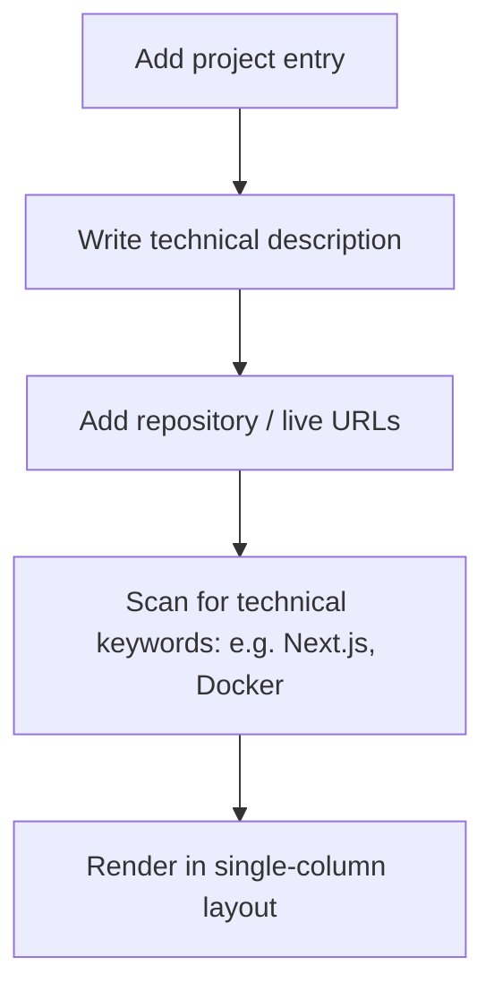

This page documents how to configure, present, and describe your project highlights in the resume builder workspace.

---

## 1. Why Projects Matter on an ATS Resume

For developers and product managers, the projects section demonstrates practical application of your skills. ATS parsers match project descriptions with required keywords:

---

## 2. Formatting Your Project Descriptions

To make your project entries stand out, structure each description using these guidelines:

<Tabs items={['Technical Context', 'Individual Contribution', 'Quantitative Results']}>
  <Tab value="Technical Context">
    ### Technical Context & Tech Stack
    - State the purpose of the project clearly in the first sentence.
    - Specify the core technologies used (e.g. *Built with Next.js, Go, and PostgreSQL*).
  </Tab>
  <Tab value="Individual Contribution">
    ### Your Role & Execution
    - Explain your individual contributions to the project.
    - Focus on technical decisions (e.g. *Migrated database schemas to improve query response times*).
  </Tab>
  <Tab value="Quantitative Results">
    ### Metrics & Achievements
    - Quantify the impact of your project where possible (e.g. *Reduced bundle size by 35%*, *improved database search times by 1.2 seconds*).
  </Tab>
</Tabs>

---

## 3. Best Practices for Project Entries

- **Keep Links Clean:** Use standard hyperlink text (e.g. *"GitHub Repository"* or *"Live Application"*) rather than raw URLs to keep the layout clean.
- **Limit Project Entries:** Highlight **2-3 projects** that are relevant to your target role to keep the document concise.
