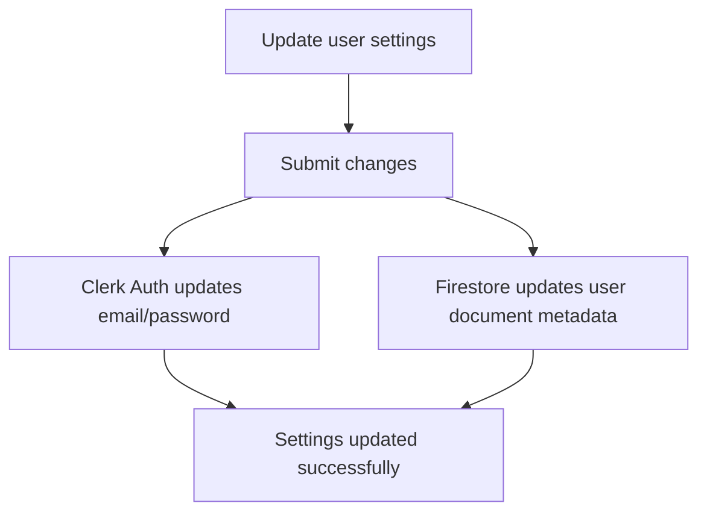

This page documents how to configure, update, and manage your account details inside the Mockrithm console.

---

## 1. Profile Dashboard Controls

Your user settings are divided into three areas:

<Tabs items={['General Profile', 'Security & Passwords', 'Data Deletion']}>
  <Tab value="General Profile">
    ### User Profile
    - **Avatar Updates:** Update your profile picture.
    - **Name & Contacts:** Change your display name and email address.
    - **Notification Settings:** Toggle email alerts for completed interview feedback reports.
  </Tab>
  <Tab value="Security & Passwords">
    ### Security Settings
    - **Password Updates:** Reset your account password.
    - **Two-Factor Auth:** Enable multi-factor authentication (MFA) via the Clerk security dashboard.
  </Tab>
  <Tab value="Data Deletion">
    ### Permanent Account Deletion
    - Request deletion of your candidate profile.
    - Purges all stored resumes, feedback reports, and audio recordings from Firestore.
    - Cancels active Stripe billing subscriptions automatically.
  </Tab>
</Tabs>

---

## 2. Managing Settings

---

## 3. Frequently Asked Questions

<Accordions>
  <Accordion title="How do I change my billing email?">
    Update your email address in the general profile settings. The new email address is synced to Stripe automatically during your next subscription update.
  </Accordion>
  <Accordion title="Can I recover deleted data?">
    No. Data deletion is permanent. Once you confirm deletion, all resumes and interview transcripts are purged from our servers and cannot be recovered.
  </Accordion>
</Accordions>
