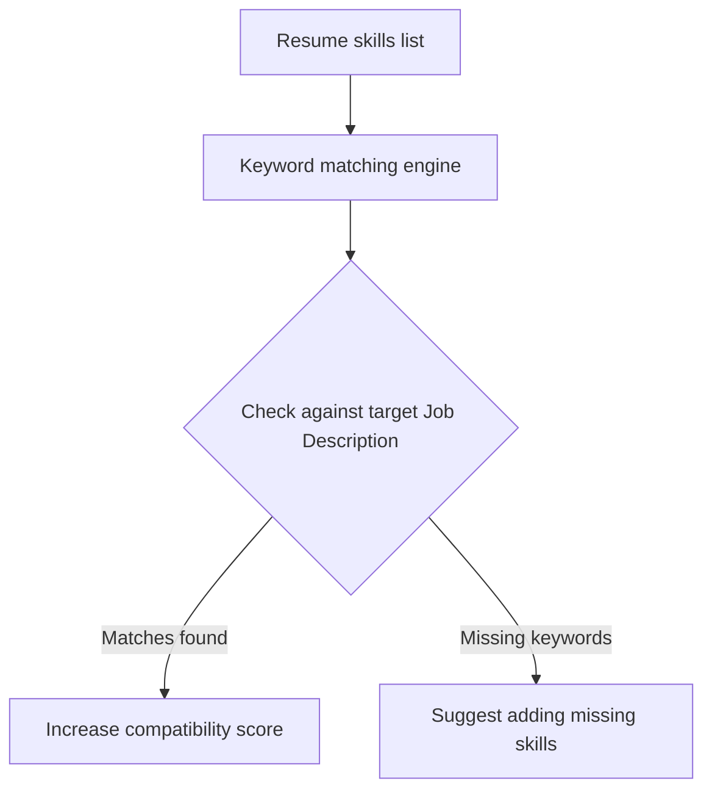

This page documents how to configure, group, and manage your skills within the Mockrithm resume workspace.

---

## 1. Role in the ATS Scoring System

Applicant Tracking Systems (ATS) scan the skills section of your resume to determine compatibility with target job descriptions. Mockrithm scores your resume by matching your skills against target keywords:

---

## 2. Dynamic Grouping Categories

To make your resume easy to read for both humans and parsers, group your skills into distinct categories:

<Tabs items={['Languages & Core', 'Frameworks & Libraries', 'Databases & Tools']}>
  <Tab value="Languages & Core">
    ### Core Programming Languages
    - Group languages like TypeScript, Go, Python, and C++.
    - List the languages you are most comfortable with first.
  </Tab>
  <Tab value="Frameworks & Libraries">
    ### Web Frameworks & Libraries
    - Group frameworks like Next.js, React, Node.js, and Express.
    - Avoid listing minor dependencies or libraries that are not relevant to the target role.
  </Tab>
  <Tab value="Databases & Tools">
    ### Databases & Developer Tools
    - Group tools like PostgreSQL, Redis, Docker, and Git.
    - Demonstrates experience with hosting and deployment workflows.
  </Tab>
</Tabs>

---

## 3. Best Practices for Keywords

<Callout type="warn" title="Avoid Keyword Stuffing">
Listing skills you have never used just to match keywords is flagged by our analyzer and can lead to issues during live technical interviews.
</Callout>

- **Match Job Descriptions:** Analyze the requirements of your target role and list relevant skills near the top of the section.
- **Keep Groups Focused:** Limit each skill category to **8-10 keywords** to keep the section clean and easy to read.
