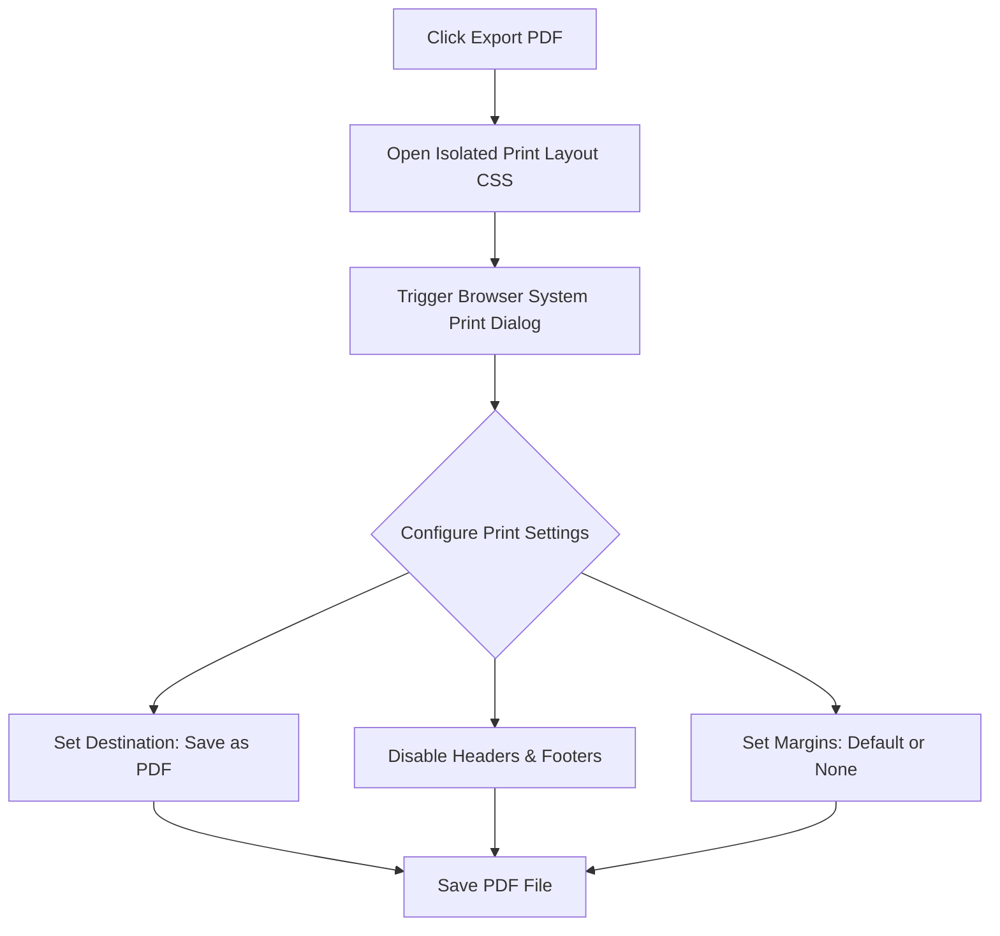

This page provides instructions for exporting your resume to PDF from the editor workspace.

---

## 1. Exporting Workflow Overview

To ensure your exported PDF maintains the correct formatting, we render the document as a clean print sheet and use your system's print dialog to save the PDF.

---

## 2. Printer Settings Configuration

To prevent formatting issues (like extra blank pages or cut-off text), configure your browser's print settings as follows:

<Steps>
  <Step>
    ### Open the Print Dialog
    In the editor console, click **Export PDF** (or press `Ctrl+P` / `Cmd+P`).
  </Step>
  <Step>
    ### Choose the Destination
    Change the printer destination setting from your physical printer to **Save as PDF** or **Microsoft Print to PDF**.
  </Step>
  <Step>
    ### Disable Headers and Footers
    In the print settings panel, uncheck the **Headers and Footers** option.
    
    <Callout type="warn" title="Why Disable Headers?">
      If enabled, browsers will print page URLs, timestamps, and page numbers at the top and bottom of your resume. This clutter can trigger parsing errors in some applicant tracking systems (ATS).
    </Callout>
  </Step>
  <Step>
    ### Configure Margins
    Set margins to **Default** or **None**. The resume templates include built-in margins, so adding extra margins in your browser settings can throw off the alignment.
  </Step>
</Steps>

---

## 3. Best Practices & Troubleshooting

<Accordions>
  <Accordion title="Extra Blank Page at the End">
    If the exported PDF includes an extra blank page, your content may be slightly exceeding the page limit guide. Try:
    - Reducing margin spacings in the editor.
    - Condensing highlight descriptions.
    - Lowering spacing parameters by a few pixels.
  </Accordion>
  <Accordion title="Hyperlink Validation">
    Ensure email addresses and portfolio URLs remain clickable in the exported PDF. Standard PDF readers parse paths matching `mailto:email@example.com` or `https://...` automatically.
  </Accordion>
</Accordions>
