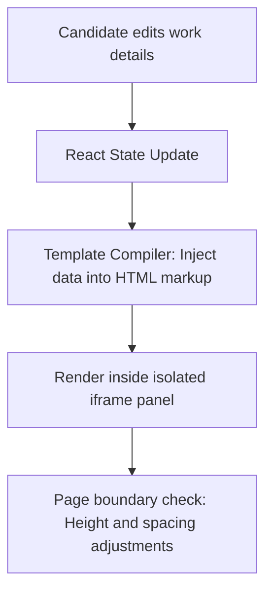

This page explains how the live HTML preview pane renders and validates your resume as you type.

---

## 1. Live Rendering Pipeline

The Resume Builder uses a split-pane layout. The left pane contains form inputs, and the right pane displays the rendered document.

---

## 2. Preview Panels Capabilities

The preview pane offers features to ensure formatting matches the final exported PDF:

<Tabs items={['Isolated Styling', 'Page Spacing Guides', 'Mobile Adaptation']}>
  <Tab value="Isolated Styling">
    ### Iframe Sandbox Isolation
    To prevent the application's global styles (like dark backgrounds) from affecting the resume design, the preview is rendered inside an isolated `<iframe>`. This ensures that the document renders with a clean white background, matching standard print outputs.
  </Tab>
  <Tab value="Page Spacing Guides">
    ### Page Boundary Guides
    The preview shows dotted red lines indicating page boundaries (A4 / Letter size). This helps you keep your resume within the standard **1-page** or **2-page** limits.
  </Tab>
  <Tab value="Mobile Adaptation">
    ### Scaling Controls
    On mobile viewports, the preview pane scales down to fit the screen. You can zoom or pan to inspect details without changing the layout.
  </Tab>
</Tabs>

---

## 3. Best Practices for Preview Checking

<Callout type="info" title="Preview Alignment">
Always verify that section headings align correctly. The preview pane updates dynamically as you type, allowing you to catch line-wrapping issues early.
</Callout>

- **Keep Content Concise:** If text overflows the page boundary guide, condense descriptions or adjust font sizes to fit everything onto a single page.
- **Check Contact Details:** Ensure links and emails are visible and fit within their respective containers.
