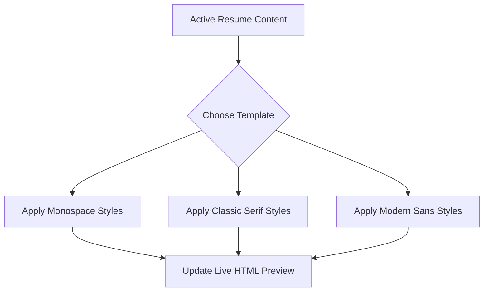

This page documents the resume templates available in the Mockrithm workspace and explains how to choose the best layout for your industry.

---

## 1. Template Design Philosophy

All Mockrithm templates are built using **single-column layouts** and standard typographic rules. This ensures that text sections are extracted in the correct order by applicant tracking systems (ATS).

---

## 2. Template Catalog & Recommendations

Choose from the layouts below to match your experience level and target role:

| Template Name | Design Style | Best For | Focus Areas |
| :--- | :--- | :--- | :--- |
| **Monospace Minimal** | Tech-focused, clean borders | Software Engineers, DevOps | Code-level skills, projects, and certifications. |
| **Classic Serif** | Traditional, elegant headings | Executives, Lawyers, Finance | Work history depth, leadership, and metrics. |
| **Modern Sans** | Clean layout, high contrast | Product Managers, Designers | Highlights project outcomes and metrics. |
| **Academic Curriculum** | Section-rich layout | Researchers, PhD Candidates | Publications, awards, and certifications. |

---

## 3. Template Switcher Guide

You can switch layouts dynamically in the editor without losing your data:

<Callout type="info" title="Universal Data Sync">
Your work experience details, skills list, and contact details are stored in a standard JSON schema. When you switch templates, only the styling rules (fonts, margins, borders) change, keeping your content intact.
</Callout>

---

## 4. Customizing Styles

<Accordions>
  <Accordion title="Adjusting Font Sizes">
    Keep font sizes within standard readability ranges:
    - **Name Header:** `18 - 24pt`
    - **Section Headings:** `13 - 16pt`
    - **Body Copy:** `10 - 11.5pt`
  </Accordion>
  <Accordion title="Margin Options">
    Keep page margins at `0.5 inches` or `1 inch`. Setting margins below `0.5 inches` can cut off text when printing or exporting to PDF formats.
  </Accordion>
</Accordions>
