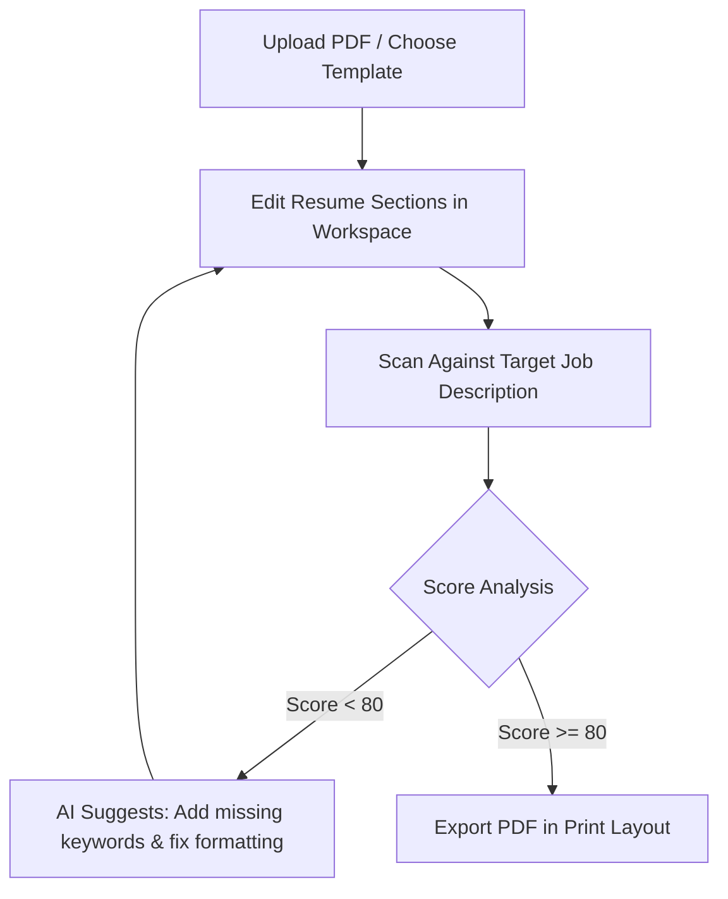

This page provides a detailed guide on using Mockrithm's **ATS Resume Builder** to create parser-compliant resumes.

---

## 1. Resume Optimization Pipeline

The Resume Builder helps you optimize your resume to pass Applicant Tracking Systems (ATS).

---

## 2. Dynamic Workspace Features

The Resume Workspace includes three key modules to help you build and refine your resume:

<Tabs items={['Live HTML Editor', 'ATS Scanner', 'JSON Workspace']}>
  <Tab value="Live HTML Editor">
    ### Live HTML Editor
    - Modify sections (Basics, Work History, Education, Skills, Projects) using simple forms.
    - Review formatting updates in real time using the live preview pane.
    - Emphasizes parser-friendly, single-column styling.
  </Tab>
  <Tab value="ATS Scanner">
    ### ATS Analyzer & Scanner
    - Paste a target job description to scan your resume for keyword alignment.
    - Highlights critical skills and keywords missing from your resume.
    - Evaluates work history descriptions for action verb usage.
  </Tab>
  <Tab value="JSON Workspace">
    ### JSON Resume Editor
    - Export your resume data as a clean JSON document.
    - Edit the JSON schema directly to apply advanced customizations.
    - Port your resume data to other platforms that support the JSON Resume standard.
  </Tab>
</Tabs>

---

## 3. Formatting Guidelines

<Callout type="warn" title="Avoid Multi-Column Layouts">
Most Applicant Tracking Systems (ATS) read resumes from left to right, top to bottom. Multi-column layouts can cause text overlap or read out of order, leading to incorrect evaluations. Always use clean, single-column formats.
</Callout>

### Common Formatting Mistakes

| Formatting Element | ATS Assessment | Recommendation |
| :--- | :--- | :--- |
| **Complex Tables** | High parsing failure rate | Use clean tab-stops or simple margins to align text. |
| **Images & Graphics** | Often ignored | Remove photos, icons, and diagrams. |
| **Custom Headers/Footers** | Missing content risk | Keep contact details within the main body page. |
| **Non-Standard Fonts** | Encoding issues | Use standard fonts like Arial, Calibri, or Georgia. |
